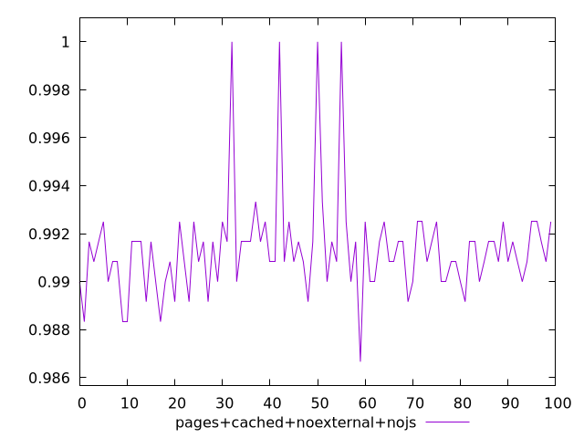
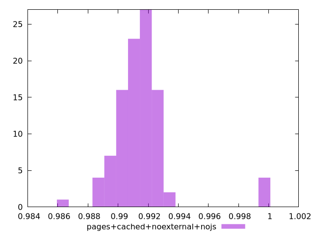
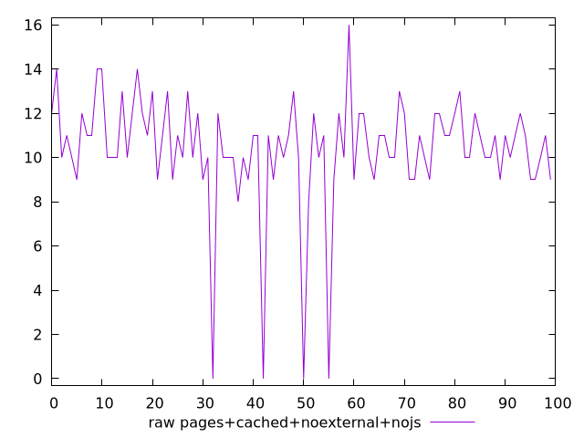
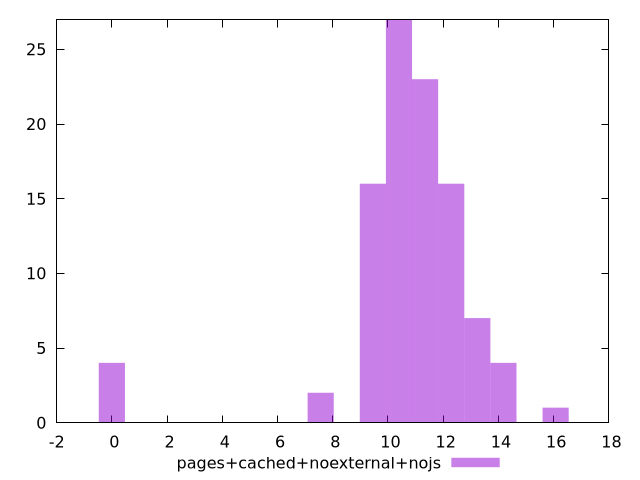

# Report pages+cached+noexternal+nojs

[parent..](./..)  


## Scores

  

## Score Histogram

  

## Score Indicators

```yaml
min: 0.9866666666666667
max: 1
range: 0.013333333333333308
mean: 0.9913499999999987
median: 0.9908333333333333
stdev: 0.002140158353435048
skewness: 2.348098077992045

```

## Raw Values

  

## Raw Values Histogram

  

## Raw Indicators

```yaml
min: 0
max: 16
range: 16
mean: 10.38
median: 11
stdev: 2.5681900241220474
skewness: -2.348098077990305

```

<style>
  img {
    max-width: 80%;
  }
</style>
      
