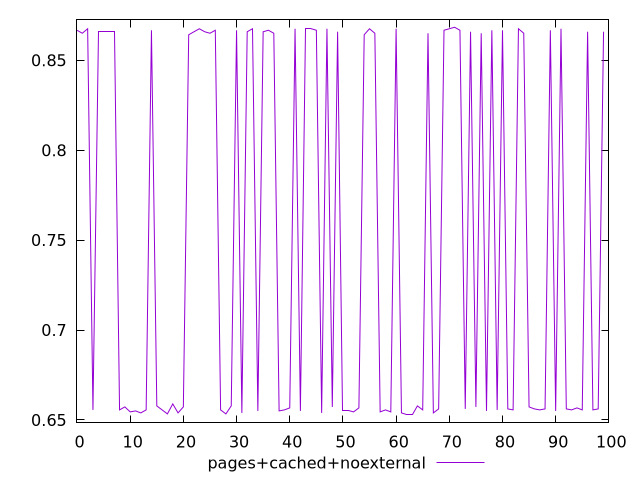
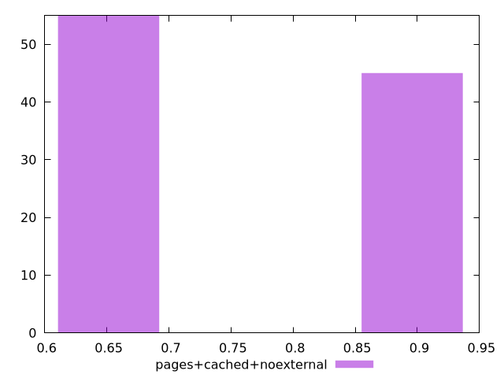
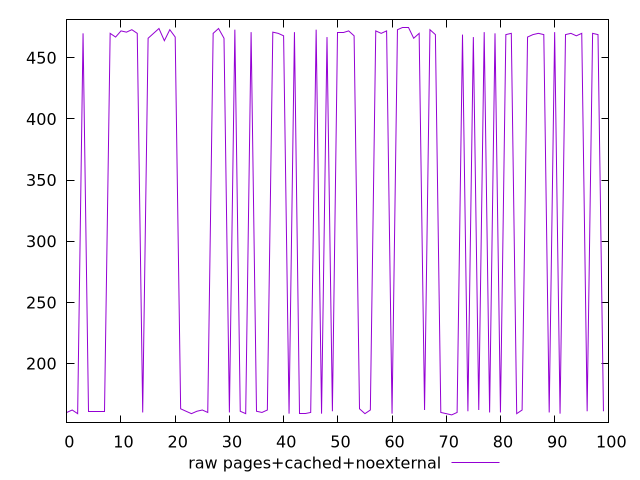
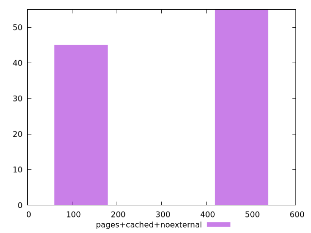

# Report pages+cached+noexternal

[parent..](./..)  


## Scores

  

## Score Histogram

  

## Score Indicators

```yaml
min: 0.6527777777777778
max: 0.8683333333333333
range: 0.2155555555555555
mean: 0.7503722222222221
median: 0.6572222222222223
stdev: 0.10489750450138119
skewness: 0.2008747988804339

```

## Raw Values

  

## Raw Values Histogram

  

## Raw Indicators

```yaml
min: 158
max: 475
range: 317
mean: 330.74
median: 467
stdev: 154.0904682321395
skewness: -0.2007023357199606

```

<style>
  img {
    max-width: 80%;
  }
</style>
      
