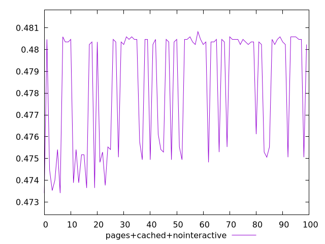
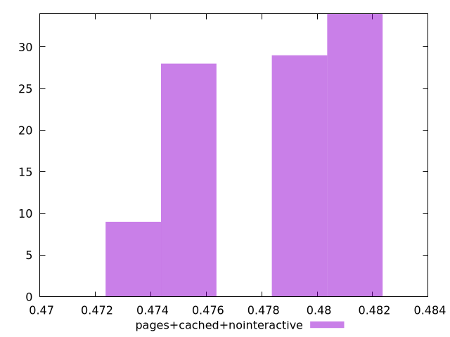
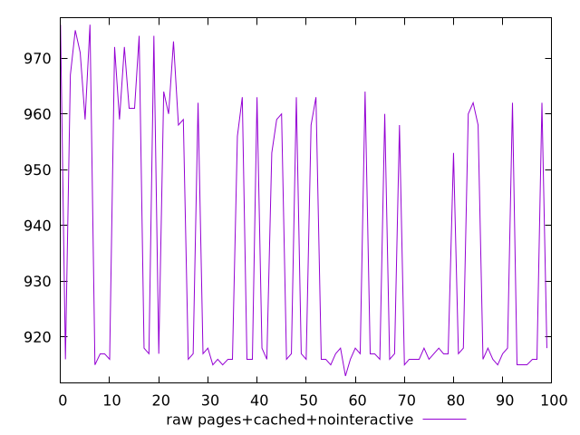
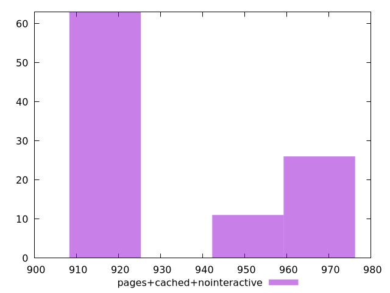

# Report pages+cached+nointeractive

[parent..](./..)  


## Scores

  

## Score Histogram

  

## Score Indicators

```yaml
min: 0.47341176470588237
max: 0.4808235294117647
range: 0.00741176470588234
mean: 0.4783694117647058
median: 0.4803529411764706
stdev: 0.0027143101489651216
skewness: -0.6268628838858613

```

## Raw Values

  

## Raw Values Histogram

  

## Raw Indicators

```yaml
min: 913
max: 976
range: 63
mean: 933.86
median: 917
stdev: 23.07163626620357
skewness: 0.6268628838859209

```

<style>
  img {
    max-width: 80%;
  }
</style>
      
