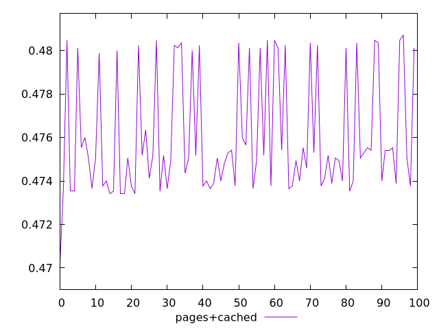
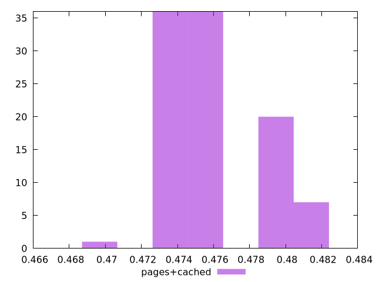
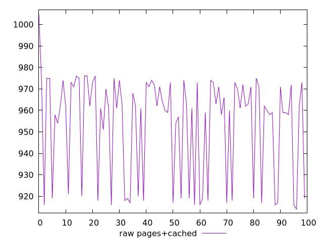
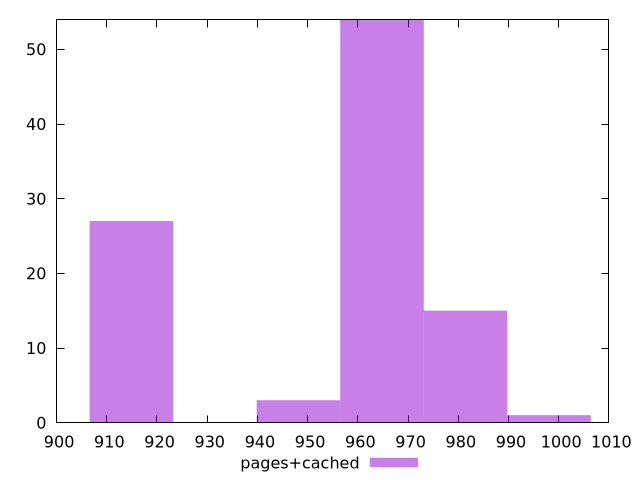

# Report pages+cached

[parent..](./..)  


## Scores

  

## Score Histogram

  

## Score Indicators

```yaml
min: 0.47
max: 0.4807058823529412
range: 0.010705882352941232
mean: 0.47602470588235285
median: 0.47505882352941176
stdev: 0.002707993805352402
skewness: 0.7055854313467972

```

## Raw Values

  

## Raw Values Histogram

  

## Raw Indicators

```yaml
min: 914
max: 1005
range: 91
mean: 953.79
median: 962
stdev: 23.017947345495422
skewness: -0.7055854313466989

```

<style>
  img {
    max-width: 80%;
  }
</style>
      
