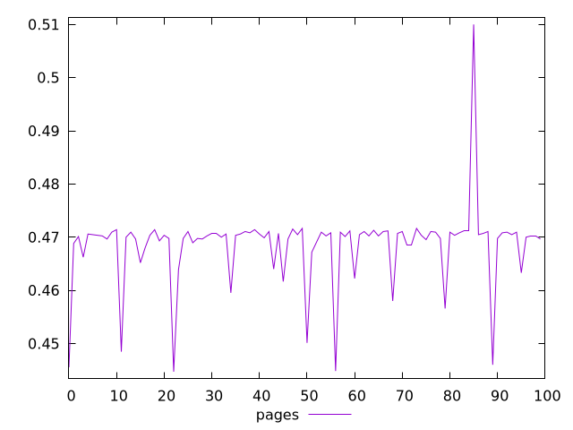
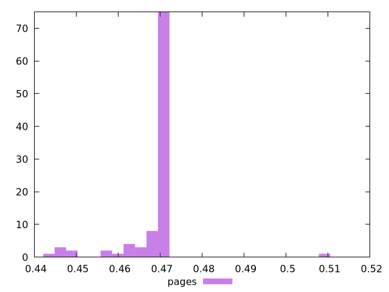
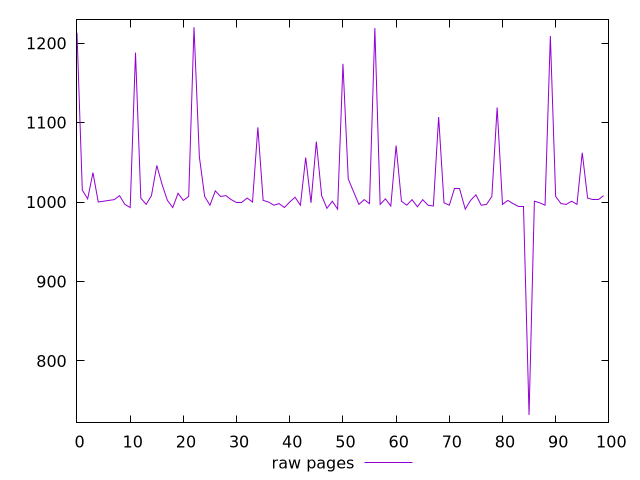
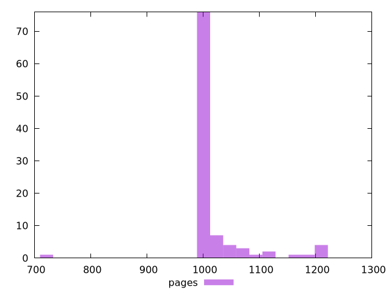

# Report pages

[parent..](./..)  


## Scores

  

## Score Histogram

  

## Score Indicators

```yaml
min: 0.4447058823529412
max: 0.51
range: 0.06529411764705884
mean: 0.46852000000000005
median: 0.4703529411764706
stdev: 0.0073993767623083155
skewness: 0.07249312088112413

```

## Raw Values

  

## Raw Values Histogram

  

## Raw Indicators

```yaml
min: 732
max: 1220
range: 488
mean: 1018.25
median: 1002
stdev: 59.394675687303824
skewness: 0.8603477349216514

```

<style>
  img {
    max-width: 80%;
  }
</style>
      
