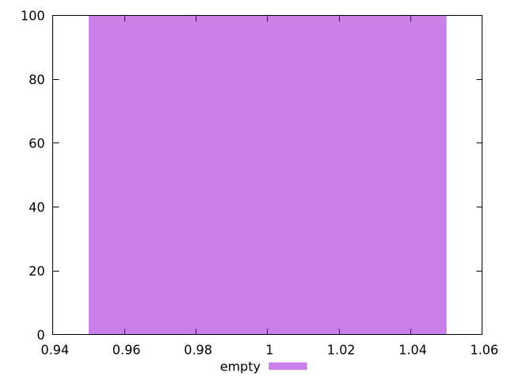

# Report empty

[parent..](./..)  


## Scores

  

## Score Histogram

  

## Score Indicators

```yaml
min: 1
max: 1
range: 0
mean: 1
median: 1
stdev: 0
skewness: .nan

```

## Raw Values

  

## Raw Values Histogram

  

## Raw Indicators

```yaml
min: 1.0739999999999998
max: 8.376999999999995
range: 7.3029999999999955
mean: 1.34652
median: 1.251
stdev: 0.7141804181017563
skewness: 9.537223405053515

```

<style>
  img {
    max-width: 80%;
  }
</style>
      
