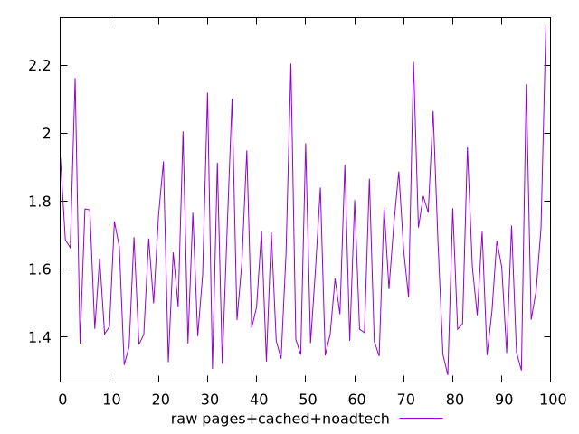
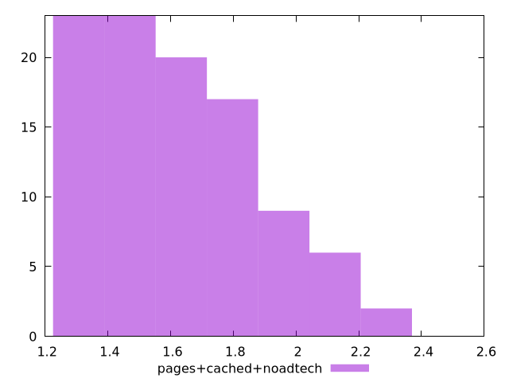

# Report pages+cached+noadtech

[parent..](./..)  


## Scores

  

## Score Histogram

  

## Score Indicators

```yaml
min: 1
max: 1
range: 0
mean: 1
median: 1
stdev: 0
skewness: .nan

```

## Raw Values

  

## Raw Values Histogram

  

## Raw Indicators

```yaml
min: 1.288
max: 2.319
range: 1.031
mean: 1.6229899999999997
median: 1.6065
stdev: 0.24920824605136965
skewness: 0.6999275284497054

```

<style>
  img {
    max-width: 80%;
  }
</style>
      
