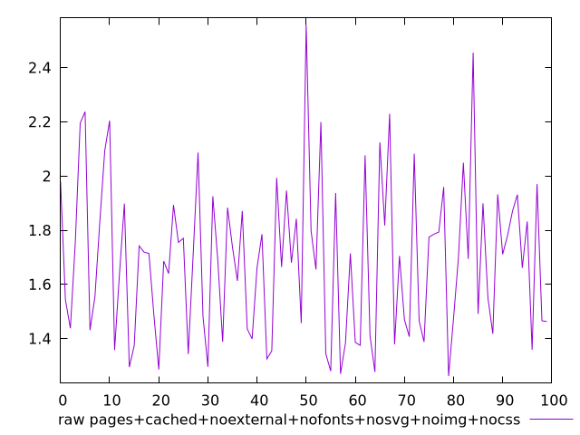
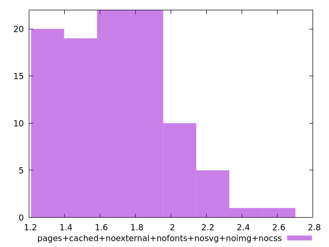

# Report pages+cached+noexternal+nofonts+nosvg+noimg+nocss

[parent..](./..)  


## Scores

  

## Score Histogram

  

## Score Indicators

```yaml
min: 1
max: 1
range: 0
mean: 1
median: 1
stdev: 0
skewness: .nan

```

## Raw Values

  

## Raw Values Histogram

  

## Raw Indicators

```yaml
min: 1.262
max: 2.558
range: 1.2959999999999998
mean: 1.690909999999999
median: 1.696
stdev: 0.28661552976068827
skewness: 0.5226447597256599

```

<style>
  img {
    max-width: 80%;
  }
</style>
      
