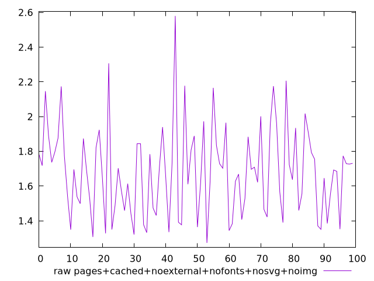
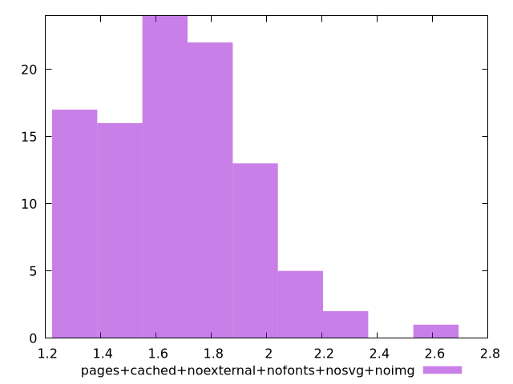

# Report pages+cached+noexternal+nofonts+nosvg+noimg

[parent..](./..)  


## Scores

  

## Score Histogram

  

## Score Indicators

```yaml
min: 1
max: 1
range: 0
mean: 1
median: 1
stdev: 0
skewness: .nan

```

## Raw Values

  

## Raw Values Histogram

  

## Raw Indicators

```yaml
min: 1.273
max: 2.58
range: 1.3070000000000002
mean: 1.6823899999999992
median: 1.6919999999999997
stdev: 0.2572429550055745
skewness: 0.6570456590358396

```

<style>
  img {
    max-width: 80%;
  }
</style>
      
