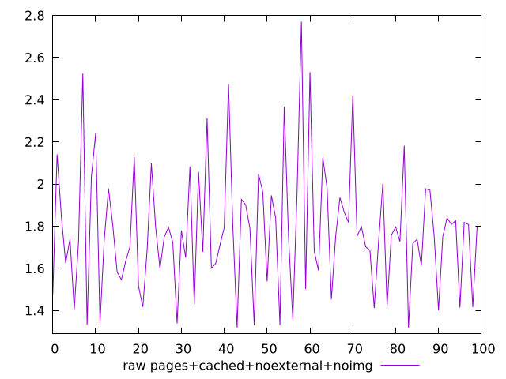
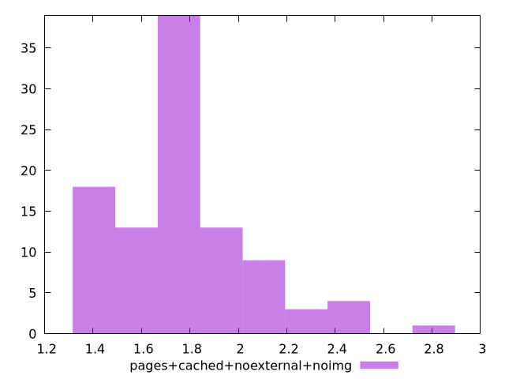

# Report pages+cached+noexternal+noimg

[parent..](./..)  


## Scores

  

## Score Histogram

  

## Score Indicators

```yaml
min: 1
max: 1
range: 0
mean: 1
median: 1
stdev: 0
skewness: .nan

```

## Raw Values

  

## Raw Values Histogram

  

## Raw Indicators

```yaml
min: 1.319
max: 2.7710000000000004
range: 1.4520000000000004
mean: 1.7797299999999998
median: 1.752
stdev: 0.29356382117011626
skewness: 0.7754281704353129

```

<style>
  img {
    max-width: 80%;
  }
</style>
      
