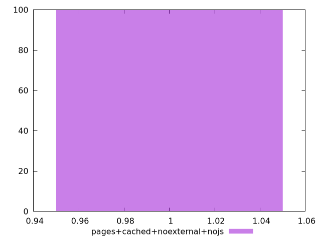
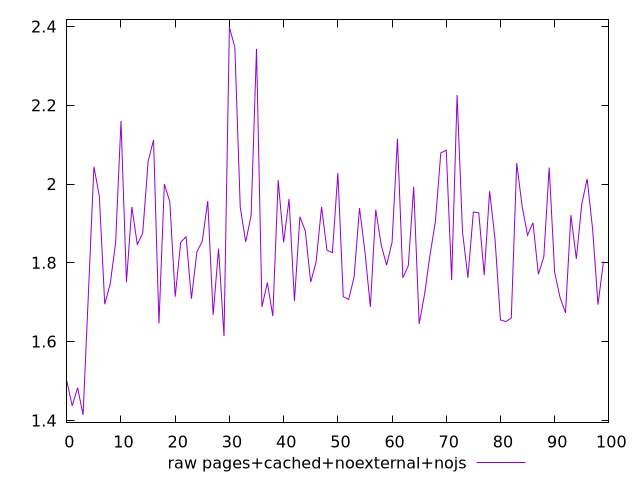
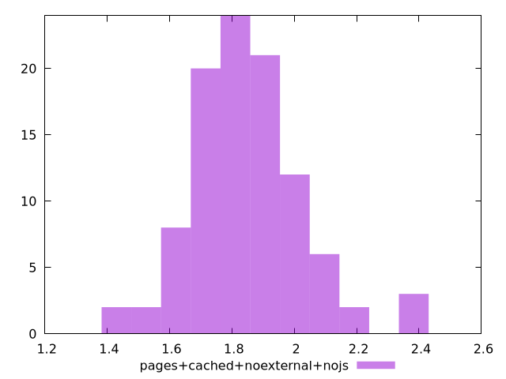

# Report pages+cached+noexternal+nojs

[parent..](./..)  


## Scores

  

## Score Histogram

  

## Score Indicators

```yaml
min: 1
max: 1
range: 0
mean: 1
median: 1
stdev: 0
skewness: .nan

```

## Raw Values

  

## Raw Values Histogram

  

## Raw Indicators

```yaml
min: 1.414
max: 2.398
range: 0.9840000000000002
mean: 1.8519700000000006
median: 1.8489999999999998
stdev: 0.17464469387874346
skewness: 0.4501351491411541

```

<style>
  img {
    max-width: 80%;
  }
</style>
      
