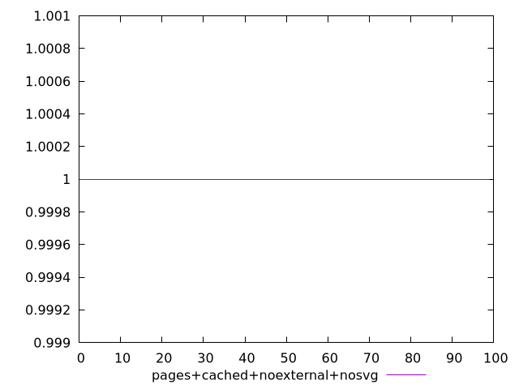
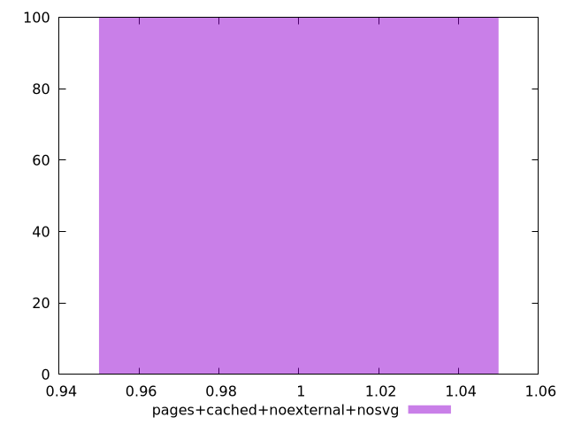
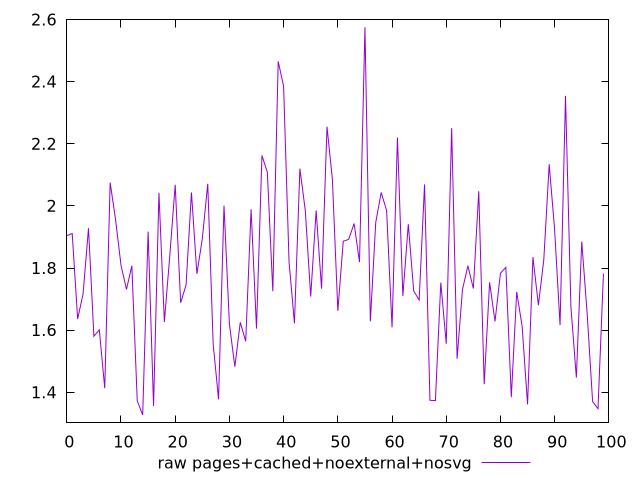
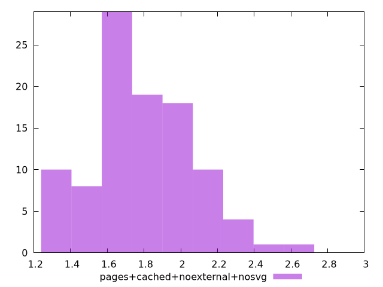

# Report pages+cached+noexternal+nosvg

[parent..](./..)  


## Scores

  

## Score Histogram

  

## Score Indicators

```yaml
min: 1
max: 1
range: 0
mean: 1
median: 1
stdev: 0
skewness: .nan

```

## Raw Values

  

## Raw Values Histogram

  

## Raw Indicators

```yaml
min: 1.327
max: 2.575
range: 1.2480000000000002
mean: 1.793000000000001
median: 1.7675
stdev: 0.2641143691660868
skewness: 0.3885964642169082

```

<style>
  img {
    max-width: 80%;
  }
</style>
      
