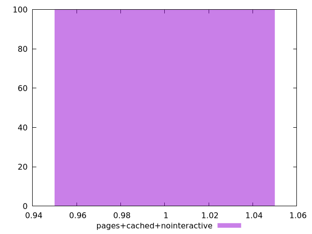
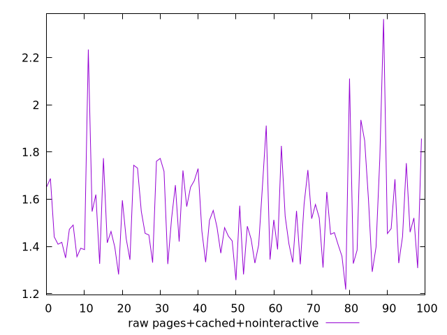
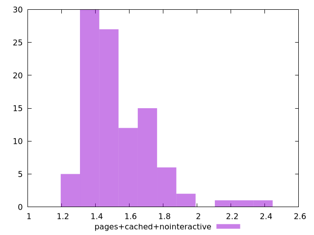

# Report pages+cached+nointeractive

[parent..](./..)  


## Scores

  

## Score Histogram

  

## Score Indicators

```yaml
min: 1
max: 1
range: 0
mean: 1
median: 1
stdev: 0
skewness: .nan

```

## Raw Values

  

## Raw Values Histogram

  

## Raw Indicators

```yaml
min: 1.218
max: 2.363
range: 1.145
mean: 1.5299300000000002
median: 1.4745
stdev: 0.20340365065553773
skewness: 1.4470498486255425

```

<style>
  img {
    max-width: 80%;
  }
</style>
      
