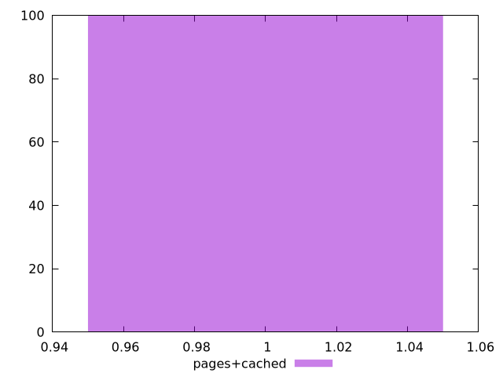

# Report pages+cached

[parent..](./..)  


## Scores

  

## Score Histogram

  

## Score Indicators

```yaml
min: 1
max: 1
range: 0
mean: 1
median: 1
stdev: 0
skewness: .nan

```

## Raw Values

  

## Raw Values Histogram

  

## Raw Indicators

```yaml
min: 1.296
max: 93.489
range: 92.193
mean: 2.4950300000000003
median: 1.5195
stdev: 9.147817797108774
skewness: 9.840897212165924

```

<style>
  img {
    max-width: 80%;
  }
</style>
      
