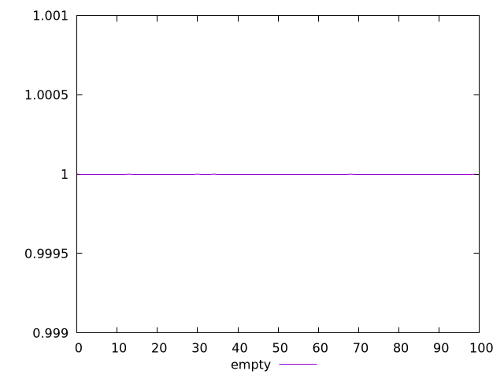
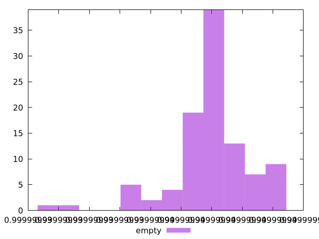

# Report empty

[parent..](./..)  


## Scores

  

## Score Histogram

  

## Score Indicators

```yaml
min: 0.99999992943681
max: 0.9999999442069185
range: 1.4770108469619458e-8
mean: 0.9999999401808283
median: 0.9999999405539501
stdev: 2.613912899885426e-9
skewness: -1.5609638800725794

```

## Raw Values

  

## Raw Values Histogram

  

## Raw Indicators

```yaml
min: 625.16225
max: 636.54885
range: 11.386600000000044
mean: 628.470438
median: 628.2082499999999
stdev: 2.0518513899052238
skewness: 1.3653662993665308

```

<style>
  img {
    max-width: 80%;
  }
</style>
      
