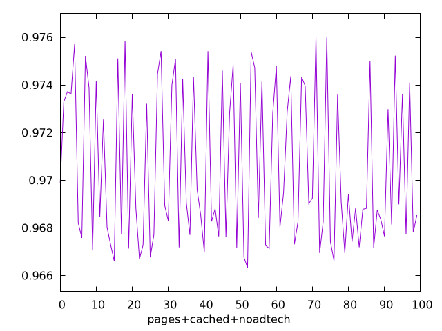
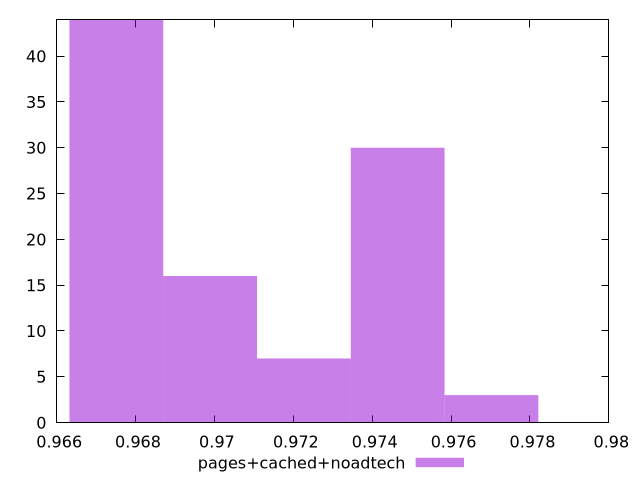
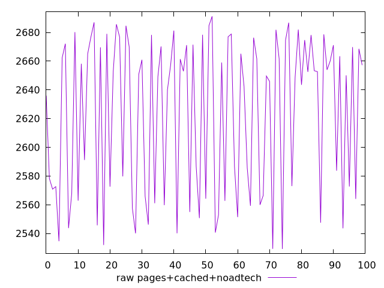
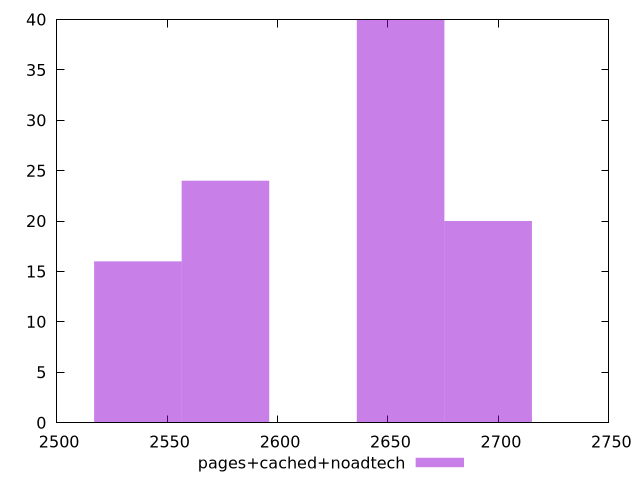

# Report pages+cached+noadtech

[parent..](./..)  


## Scores

  

## Score Histogram

  

## Score Indicators

```yaml
min: 0.9663334272595616
max: 0.9759978166272134
range: 0.009664389367651793
mean: 0.9705036759962173
median: 0.9688889684827315
stdev: 0.003248694340696892
skewness: 0.3786607627122231

```

## Raw Values

  

## Raw Values Histogram

  

## Raw Indicators

```yaml
min: 2529.1971479163985
max: 2691.1665947842575
range: 161.969446867859
mean: 2623.5971869959753
median: 2651.6236919467237
stdev: 54.279773096251034
skewness: -0.410317343013521

```

<style>
  img {
    max-width: 80%;
  }
</style>
      
