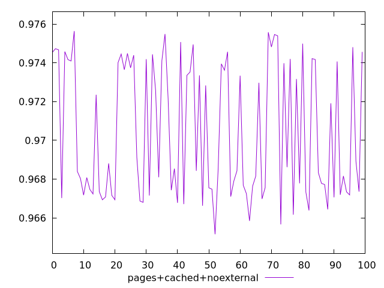
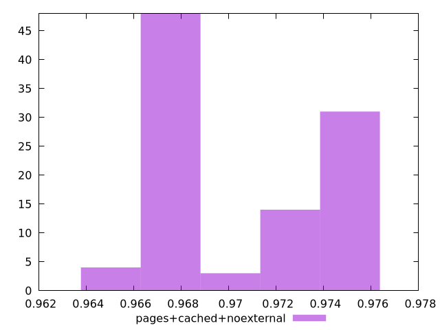
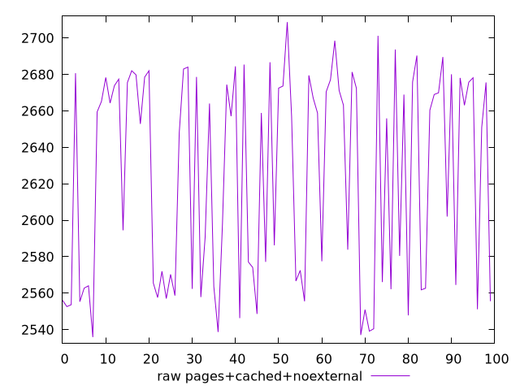
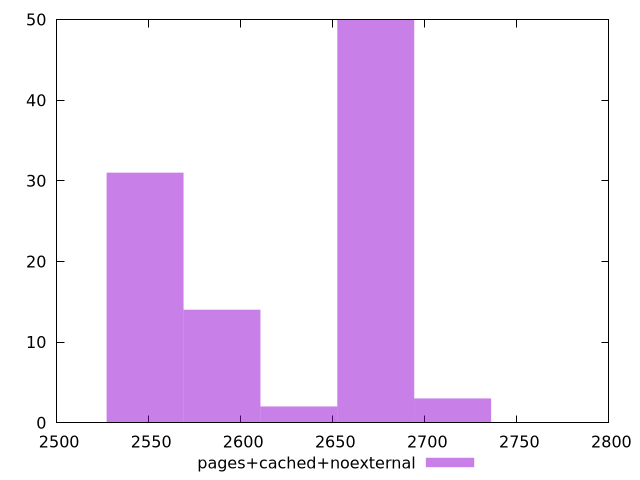

# Report pages+cached+noexternal

[parent..](./..)  


## Scores

  

## Score Histogram

  

## Score Indicators

```yaml
min: 0.965157947131433
max: 0.9756399224235794
range: 0.01048197529214645
mean: 0.9704437759769573
median: 0.9685459418375277
stdev: 0.003431316268756992
skewness: 0.19441748991565475

```

## Raw Values

  

## Raw Values Histogram

  

## Raw Indicators

```yaml
min: 2535.8910934574023
max: 2708.7153539910373
range: 172.82426053363497
mean: 2624.386491339061
median: 2657.049533571172
stdev: 56.89823745536837
skewness: -0.2205441880336679

```

<style>
  img {
    max-width: 80%;
  }
</style>
      
