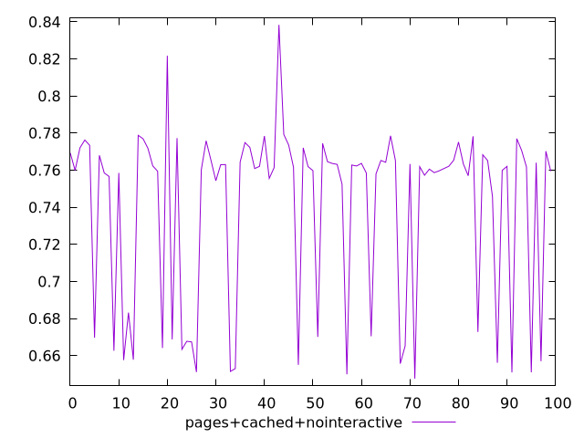
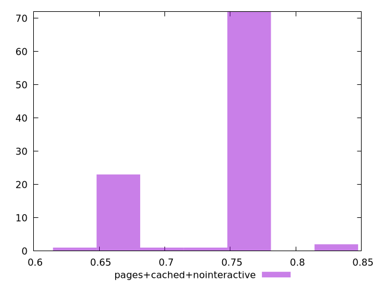
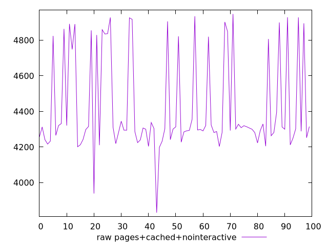
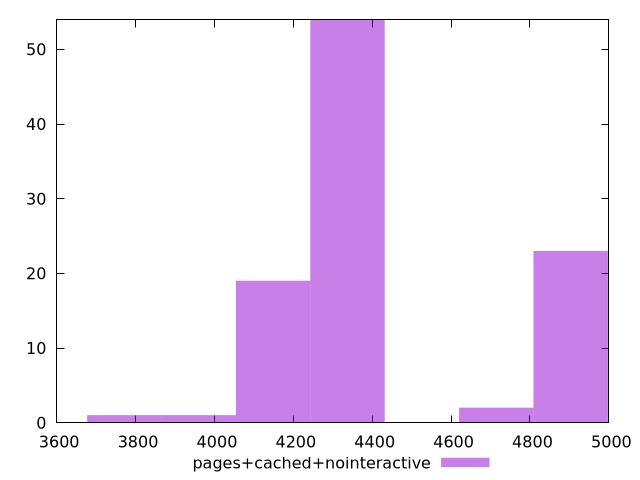

# Report pages+cached+nointeractive

[parent..](./..)  


## Scores

  

## Score Histogram

  

## Score Indicators

```yaml
min: 0.6475964215263799
max: 0.8383589612217753
range: 0.19076253969539547
mean: 0.7404214647108214
median: 0.7618074243182018
stdev: 0.047495189827639235
skewness: -0.952072410508027

```

## Raw Values

  

## Raw Values Histogram

  

## Raw Indicators

```yaml
min: 3831.5508418398394
max: 4947.316609436979
range: 1115.7657675971395
mean: 4421.415363077957
median: 4301.449219301094
stdev: 270.5921396612592
skewness: 0.9172903037294284

```

<style>
  img {
    max-width: 80%;
  }
</style>
      
