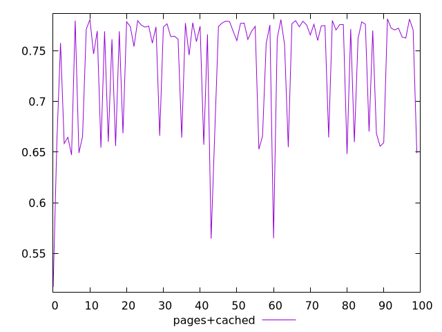
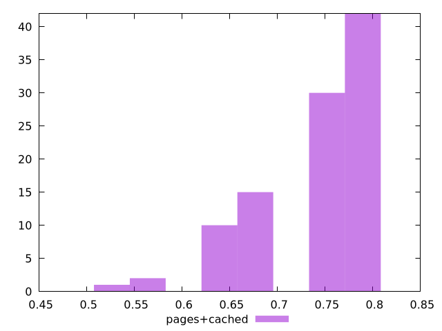
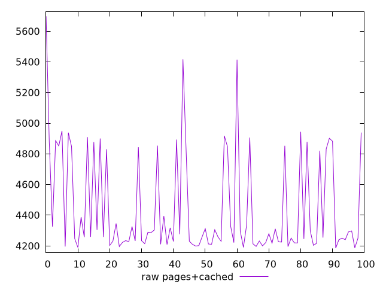
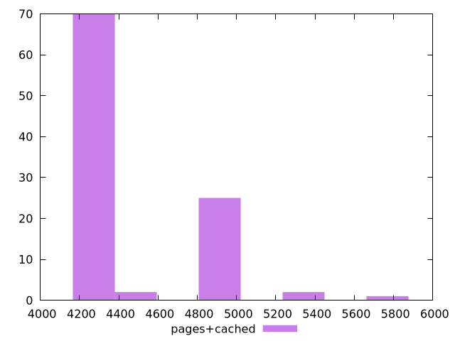

# Report pages+cached

[parent..](./..)  


## Scores

  

## Score Histogram

  

## Score Indicators

```yaml
min: 0.5169064002898659
max: 0.7815227336199034
range: 0.26461633333003753
mean: 0.7362502491372638
median: 0.7691380784057722
stdev: 0.058755351639326894
skewness: -1.4176984074109322

```

## Raw Values

  

## Raw Values Histogram

  

## Raw Indicators

```yaml
min: 4185.297575146969
max: 5697.71409607805
range: 1512.4165209310804
mean: 4444.858214118737
median: 4258.545110274914
stdev: 333.9836189800517
skewness: 1.417310980201166

```

<style>
  img {
    max-width: 80%;
  }
</style>
      
