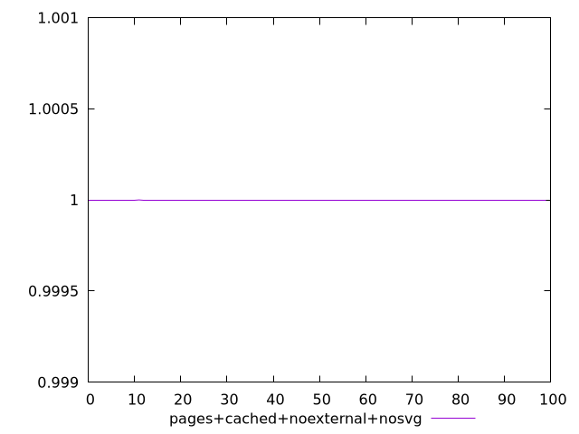
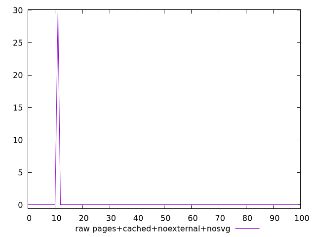
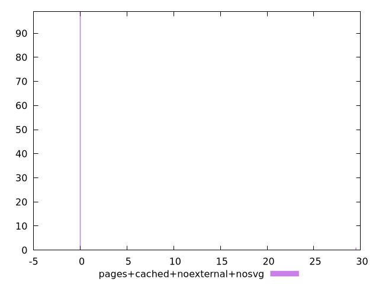

# Report pages+cached+noexternal+nosvg

[parent..](./..)  


## Scores

  

## Score Histogram

  

## Score Indicators

```yaml
min: 0.999999917458638
max: 1
range: 8.254136196761408e-8
mean: 0.9999999991745864
median: 1
stdev: 8.212761819944616e-9
skewness: -9.849370587106943

```

## Raw Values

  

## Raw Values Histogram

  

## Raw Indicators

```yaml
min: 0
max: 29.5
range: 29.5
mean: 0.295
median: 0
stdev: 2.9352129394645297
skewness: 9.8493705895403

```

<style>
  img {
    max-width: 80%;
  }
</style>
      
