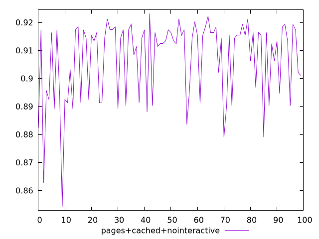
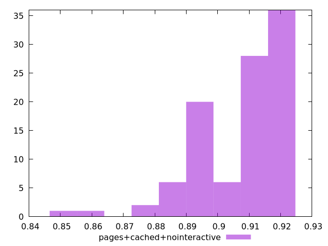
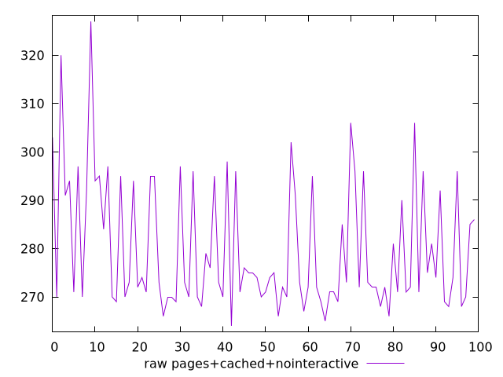
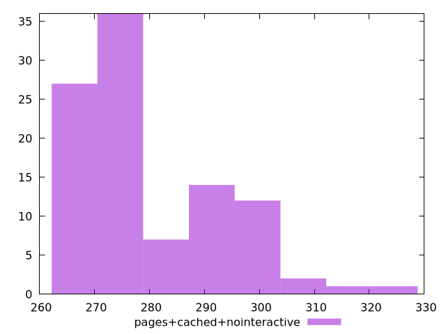

# Report pages+cached+nointeractive

[parent..](./..)  


## Scores

  

## Score Histogram

  

## Score Indicators

```yaml
min: 0.8542425396099678
max: 0.9231692315882869
range: 0.06892669197831913
mean: 0.9070426431679323
median: 0.9144159850101887
stdev: 0.013905067927047531
skewness: -1.2477394093157796

```

## Raw Values

  

## Raw Values Histogram

  

## Raw Indicators

```yaml
min: 264
max: 326.99999999999727
range: 62.99999999999727
mean: 279.8899999999996
median: 273
stdev: 13.096484261052574
skewness: 1.1306829812100767

```

<style>
  img {
    max-width: 80%;
  }
</style>
      
