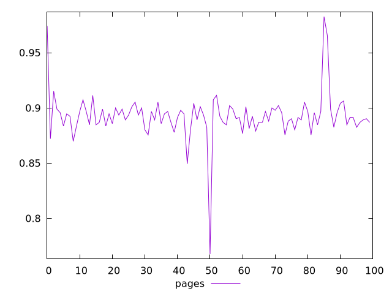
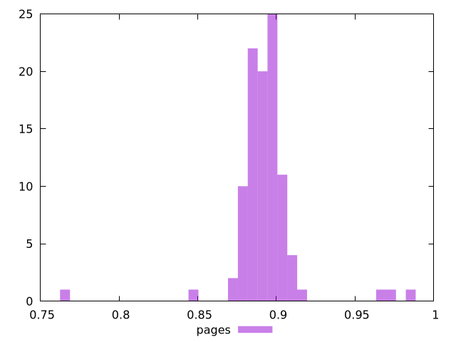
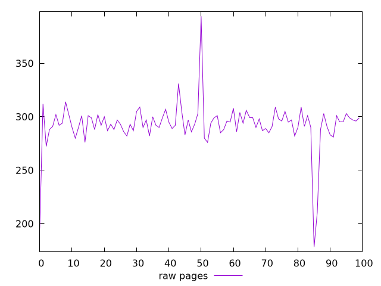
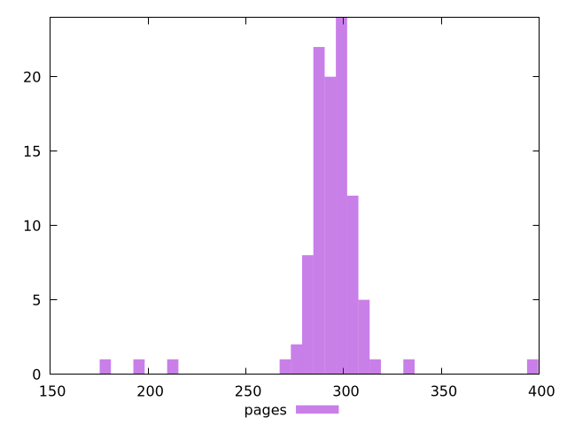

# Report pages

[parent..](./..)  


## Scores

  

## Score Histogram

  

## Score Indicators

```yaml
min: 0.7675770589246068
max: 0.9826442363466058
range: 0.215067177421999
mean: 0.8928613535321034
median: 0.8924519953997028
stdev: 0.02134601851471845
skewness: -0.42921728273098686

```

## Raw Values

  

## Raw Values Histogram

  

## Raw Indicators

```yaml
min: 178
max: 393.9999999999982
range: 215.99999999999818
mean: 292.5920149999999
median: 294
stdev: 21.896780606798597
skewness: -1.7581432333485347

```

<style>
  img {
    max-width: 80%;
  }
</style>
      
