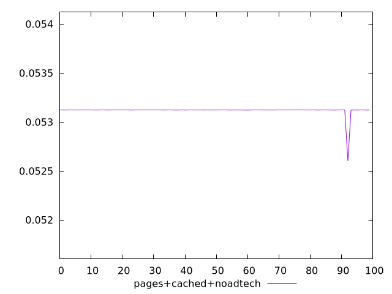
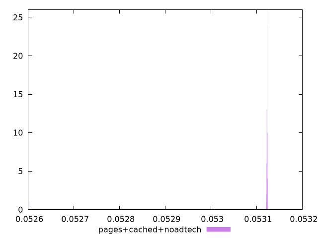
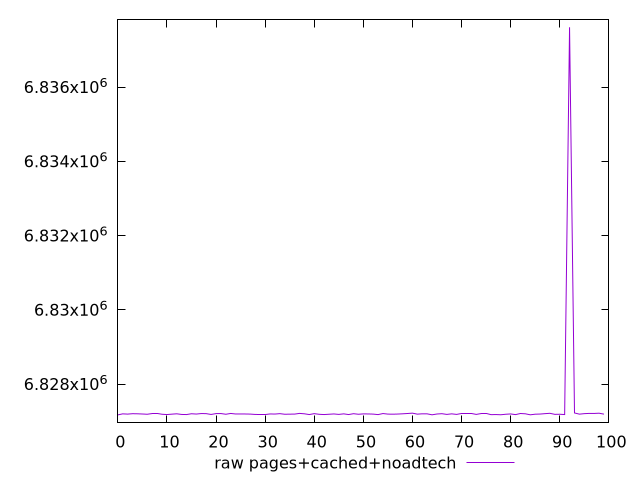
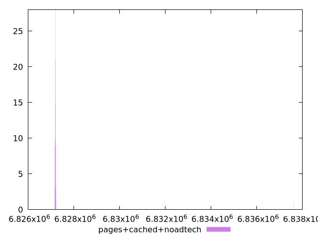

# Report pages+cached+noadtech

[parent..](./..)  


## Scores

  

## Score Histogram

  

## Score Indicators

```yaml
min: 0.05260254134591913
max: 0.05312355794511109
range: 0.0005210165991919591
mean: 0.053117179994161295
median: 0.053122355074218974
stdev: 0.000051725776161025015
skewness: -9.84782847362898

```

## Raw Values

  

## Raw Values Histogram

  

## Raw Indicators

```yaml
min: 6827167
max: 6837611
range: 10444
mean: 6827294.74
median: 6827191
stdev: 1036.8756880166488
skewness: 9.847842771171933

```

<style>
  img {
    max-width: 80%;
  }
</style>
      
