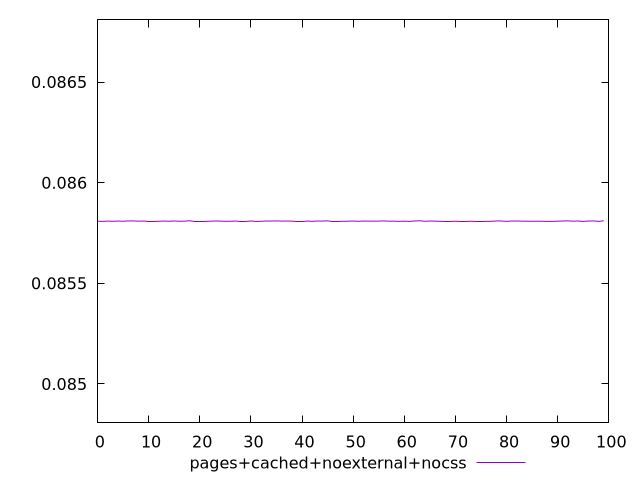
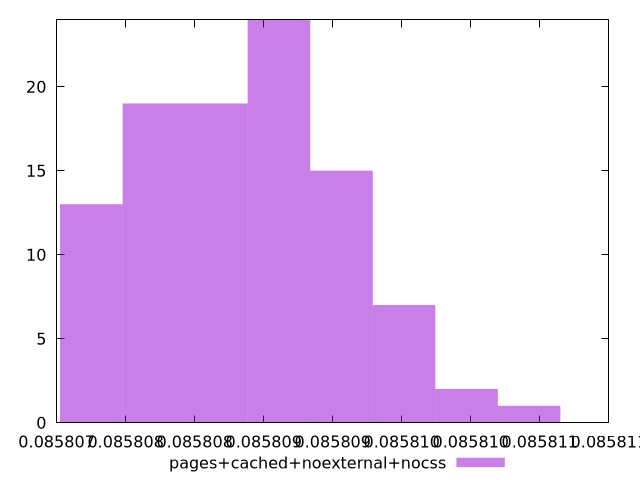
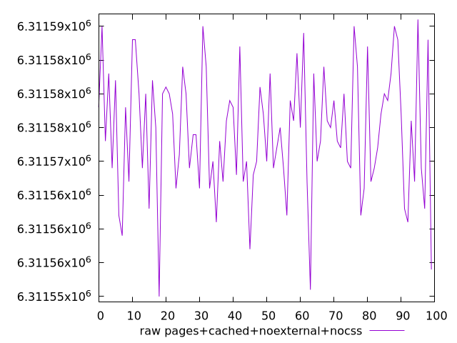
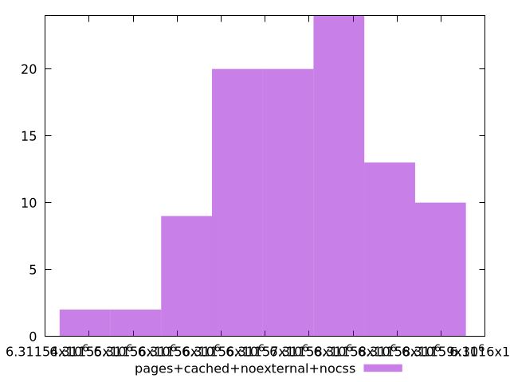

# Report pages+cached+noexternal+nocss

[parent..](./..)  


## Scores

  

## Score Histogram

  

## Score Indicators

```yaml
min: 0.0858075516366752
max: 0.08581077032782103
range: 0.000003218691145834285
mean: 0.0858088571585363
median: 0.0858088076980294
stdev: 7.148353348496486e-7
skewness: 0.24229605899226986

```

## Raw Values

  

## Raw Values Histogram

  

## Raw Indicators

```yaml
min: 6311550
max: 6311591
range: 41
mean: 6311574.37
median: 6311575
stdev: 9.10566307305513
skewness: -0.24227727378405242

```

<style>
  img {
    max-width: 80%;
  }
</style>
      
