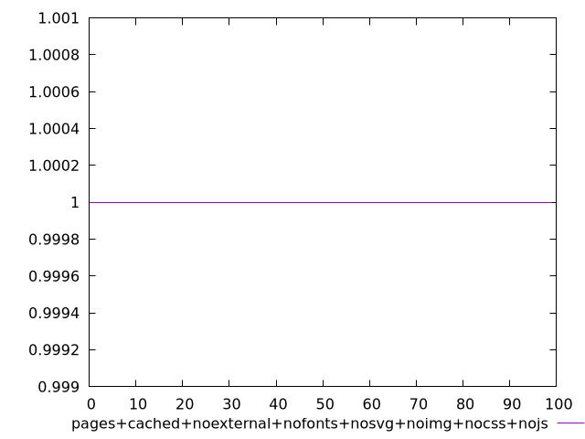
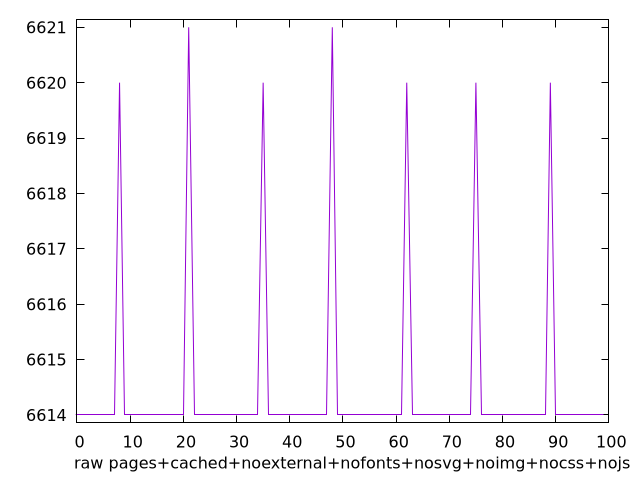
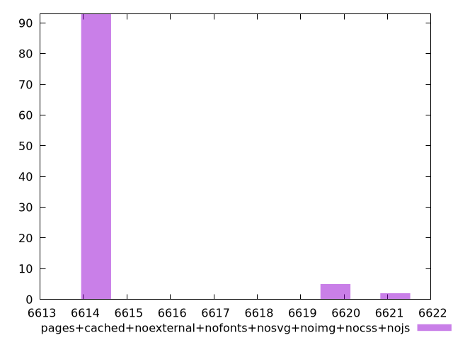

# Report pages+cached+noexternal+nofonts+nosvg+noimg+nocss+nojs

[parent..](./..)  


## Scores

  

## Score Histogram

  

## Score Indicators

```yaml
min: 1
max: 1
range: 0
mean: 1
median: 1
stdev: 0
skewness: .nan

```

## Raw Values

  

## Raw Values Histogram

  

## Raw Indicators

```yaml
min: 6614
max: 6621
range: 7
mean: 6614.44
median: 6614
stdev: 1.608228839437969
skewness: 3.4044210743867063

```

<style>
  img {
    max-width: 80%;
  }
</style>
      
