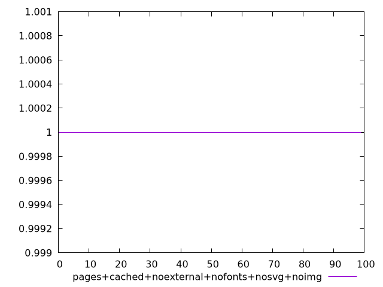
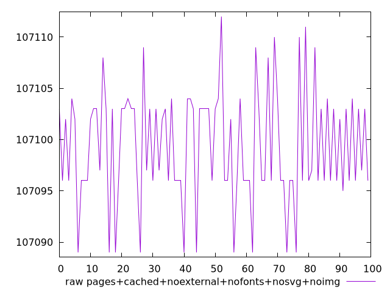
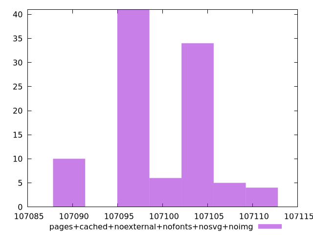

# Report pages+cached+noexternal+nofonts+nosvg+noimg

[parent..](./..)  


## Scores

  

## Score Histogram

  

## Score Indicators

```yaml
min: 1
max: 1
range: 0
mean: 1
median: 1
stdev: 0
skewness: .nan

```

## Raw Values

  

## Raw Values Histogram

  

## Raw Indicators

```yaml
min: 107089
max: 107112
range: 23
mean: 107099.4
median: 107097
stdev: 5.513619500836087
skewness: -0.04238308618747035

```

<style>
  img {
    max-width: 80%;
  }
</style>
      
