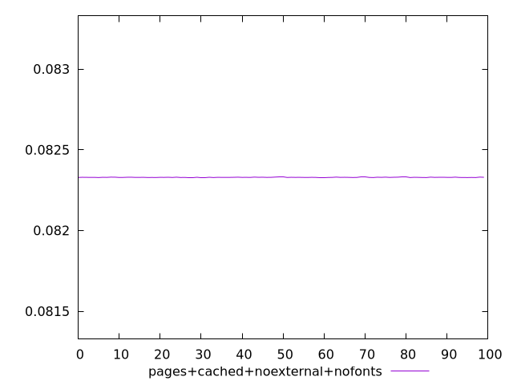
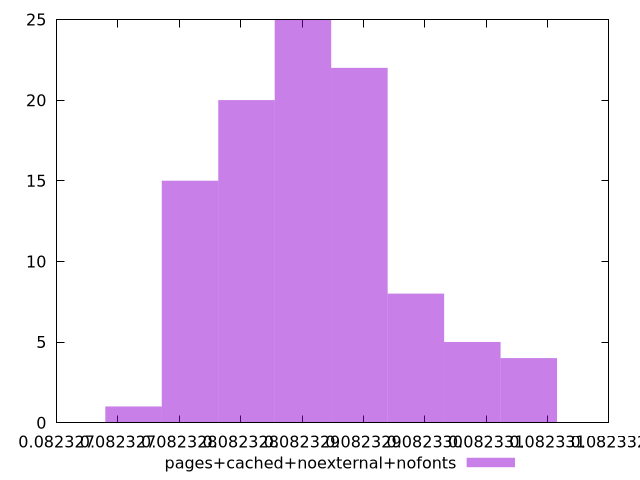
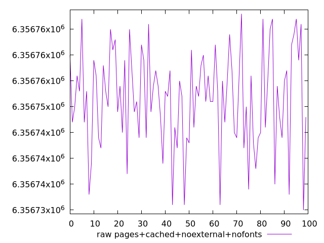
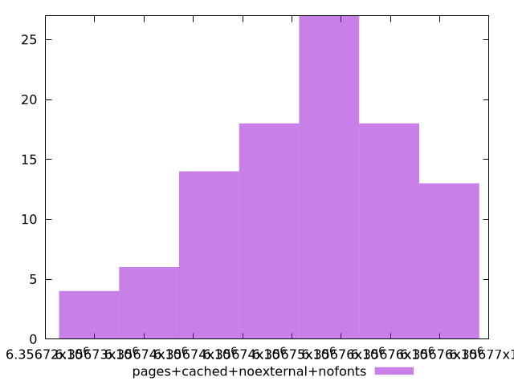

# Report pages+cached+noexternal+nofonts

[parent..](./..)  


## Scores

  

## Score Histogram

  

## Score Indicators

```yaml
min: 0.08232784618598887
max: 0.08233071751475185
range: 0.000002871328762976688
mean: 0.08232908916055842
median: 0.08232897959417856
stdev: 7.091794370585874e-7
skewness: 0.35113014994544317

```

## Raw Values

  

## Raw Values Histogram

  

## Raw Indicators

```yaml
min: 6356730
max: 6356768
range: 38
mean: 6356751.55
median: 6356753
stdev: 9.385494126576392
skewness: -0.3511129192351117

```

<style>
  img {
    max-width: 80%;
  }
</style>
      
