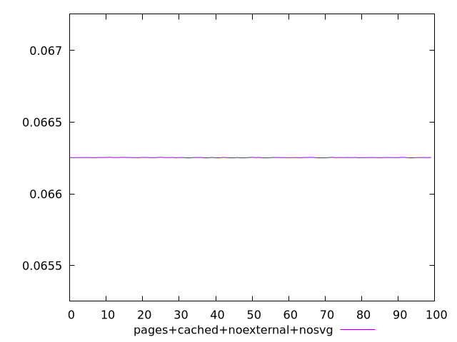
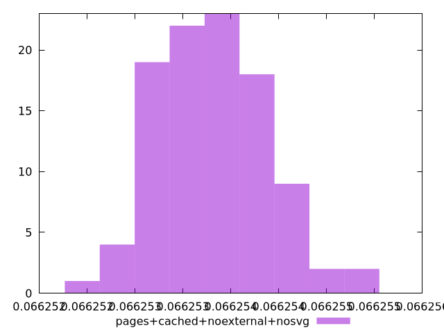
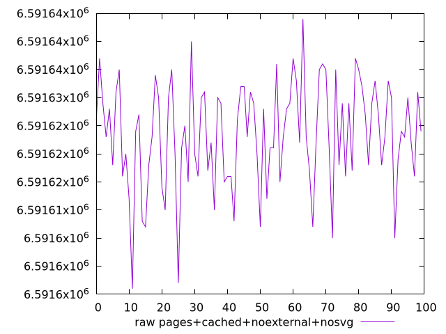
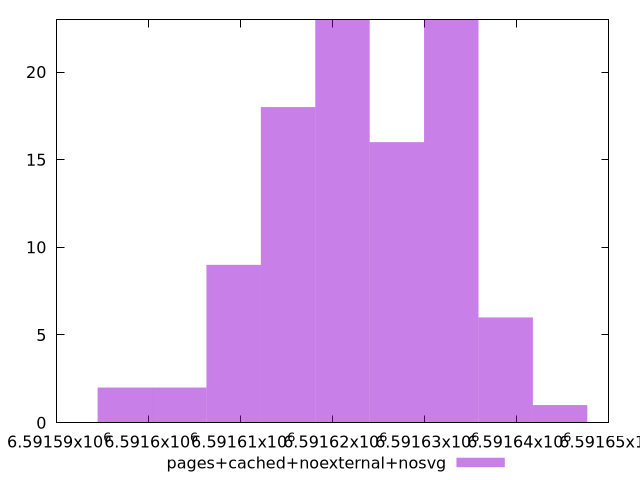

# Report pages+cached+noexternal+nosvg

[parent..](./..)  


## Scores

  

## Score Histogram

  

## Score Indicators

```yaml
min: 0.0662525056247587
max: 0.06625546840673463
range: 0.0000029627819759237006
mean: 0.06625377775643898
median: 0.06625380182659246
stdev: 5.804010015410259e-7
skewness: 0.49600213689975464

```

## Raw Values

  

## Raw Values Histogram

  

## Raw Indicators

```yaml
min: 6591596
max: 6591644
range: 48
mean: 6591623.39
median: 6591623
stdev: 9.403079282873243
skewness: -0.49598027682669965

```

<style>
  img {
    max-width: 80%;
  }
</style>
      
