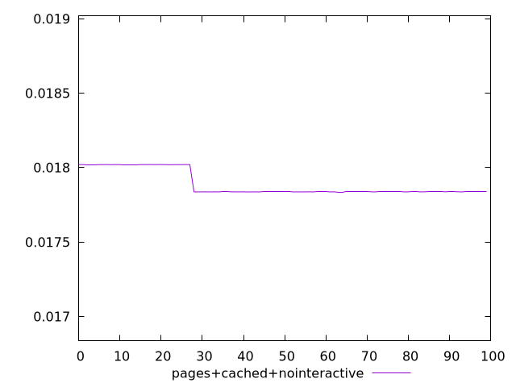
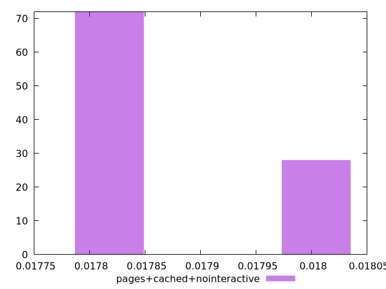
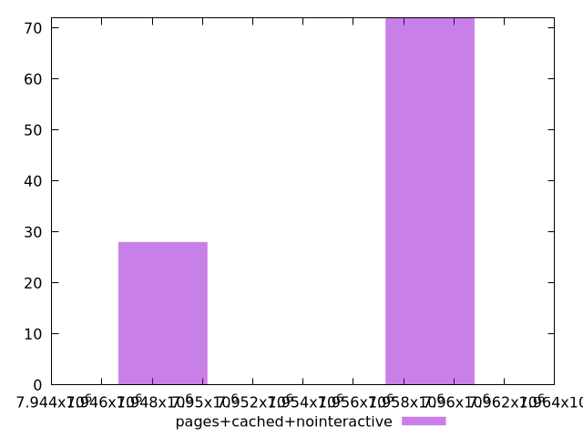

# Report pages+cached+nointeractive

[parent..](./..)  


## Scores

  

## Score Histogram

  

## Score Indicators

```yaml
min: 0.01783648779851399
max: 0.01802027229989761
range: 0.00018378450138362146
mean: 0.017888215054424474
median: 0.01783713334743764
stdev: 0.00008210868767607336
skewness: 0.9799491210597384

```

## Raw Values

  

## Raw Values Histogram

  

## Raw Indicators

```yaml
min: 7949427
max: 7959908
range: 10481
mean: 7956957.92
median: 7959871
stdev: 4682.538291738788
skewness: -0.9799489025868553

```

<style>
  img {
    max-width: 80%;
  }
</style>
      
