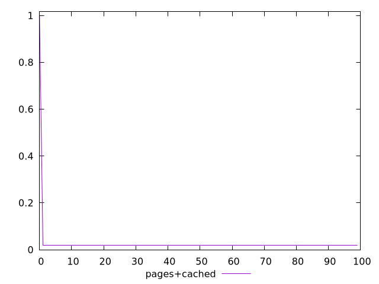
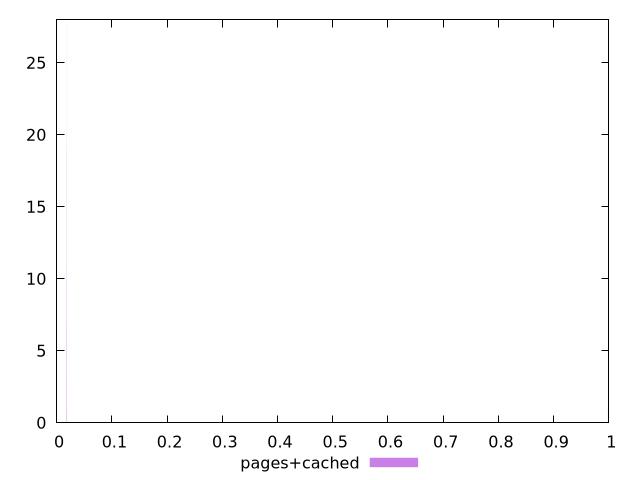
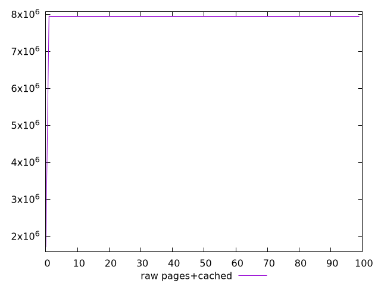
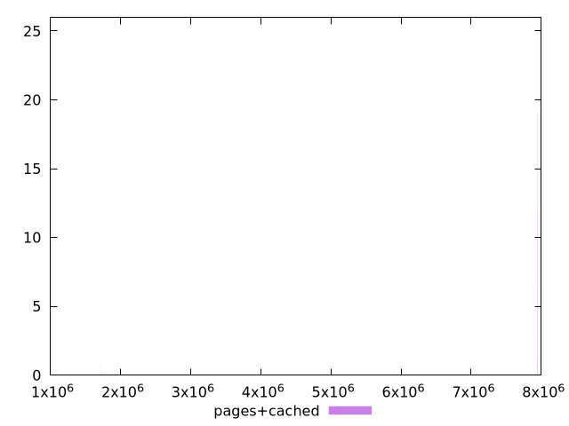

# Report pages+cached

[parent..](./..)  


## Scores

  

## Score Histogram

  

## Score Indicators

```yaml
min: 0.018019479265947214
max: 0.9972440853759366
range: 0.9792246061099894
mean: 0.027812390244904794
median: 0.018019866967155518
stdev: 0.09743155132597241
skewness: 9.849370578950833

```

## Raw Values

  

## Raw Values Histogram

  

## Raw Indicators

```yaml
min: 1702593
max: 7949472
range: 6246879
mean: 7886965.49
median: 7949450
stdev: 621552.8388576066
skewness: -9.849369752991308

```

<style>
  img {
    max-width: 80%;
  }
</style>
      
