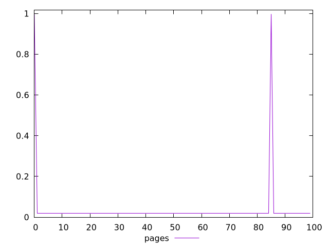
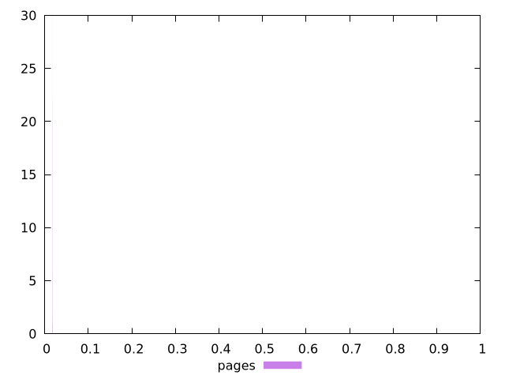
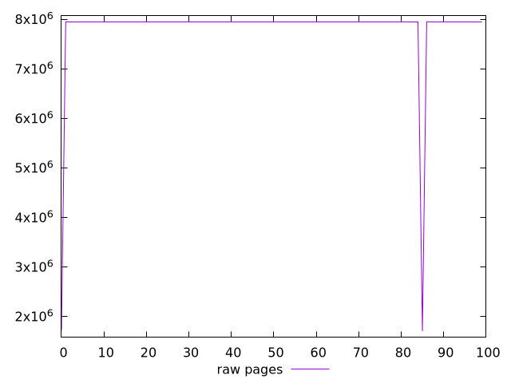
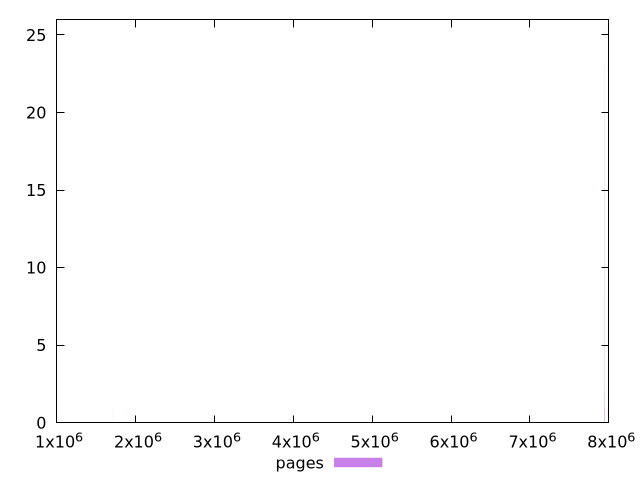

# Report pages

[parent..](./..)  


## Scores

  

## Score Histogram

  

## Score Indicators

```yaml
min: 0.01803139600571907
max: 0.9972066961239933
range: 0.9791753001182741
mean: 0.037625515997039505
median: 0.018045605709144957
stdev: 0.13706254156159753
skewness: 6.857143088913513

```

## Raw Values

  

## Raw Values Histogram

  

## Raw Indicators

```yaml
min: 1704956
max: 7948796
range: 6243840
mean: 7823328.27
median: 7947990.5
stdev: 872816.0508567983
skewness: -6.857163760585552

```

<style>
  img {
    max-width: 80%;
  }
</style>
      
