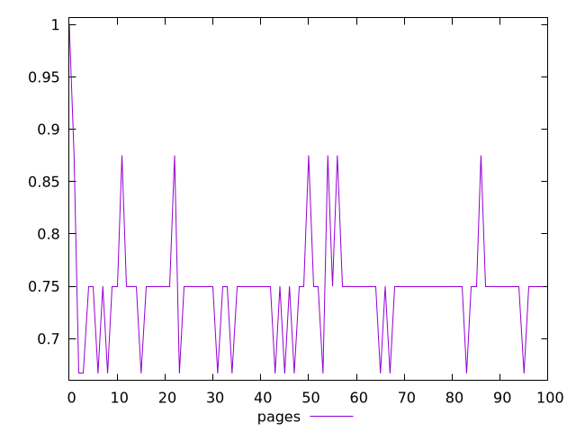
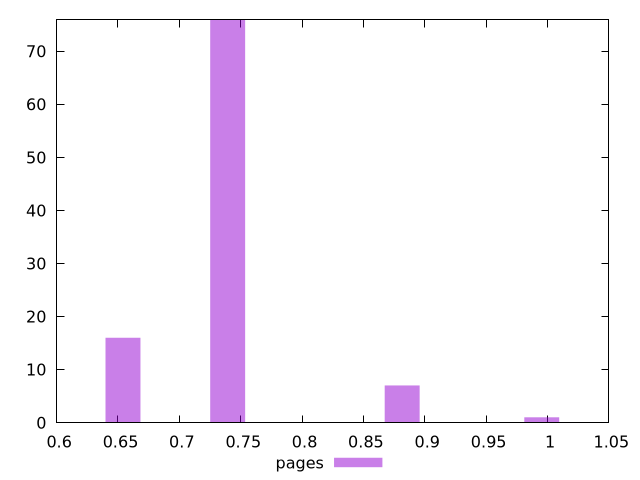
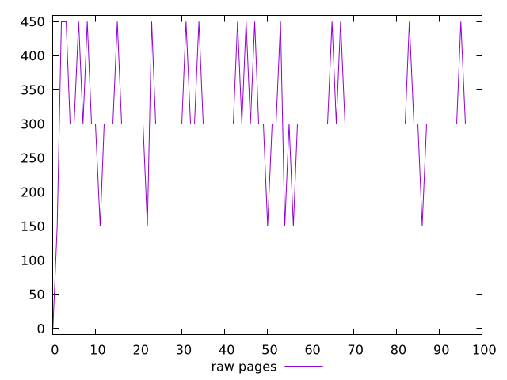
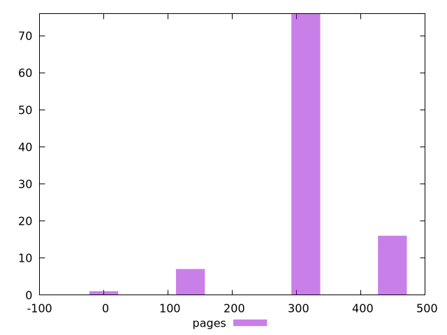

# Report pages

[parent..](./..)  


## Scores

  

## Score Histogram

  

## Score Indicators

```yaml
min: 0.6666666666666666
max: 1
range: 0.33333333333333337
mean: 0.7479166666666667
median: 0.75
stdev: 0.053155628425721135
skewness: 1.451769852954009

```

## Raw Values

  

## Raw Values Histogram

  

## Raw Indicators

```yaml
min: 0
max: 450
range: 450
mean: 310.5
median: 300
stdev: 77.231793971136
skewness: -0.3371129193695978

```

<style>
  img {
    max-width: 80%;
  }
</style>
      
