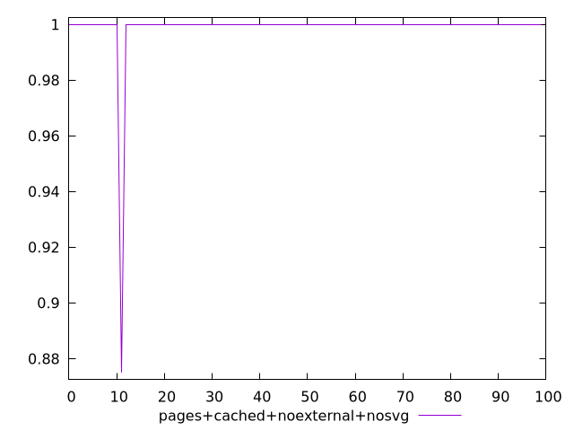
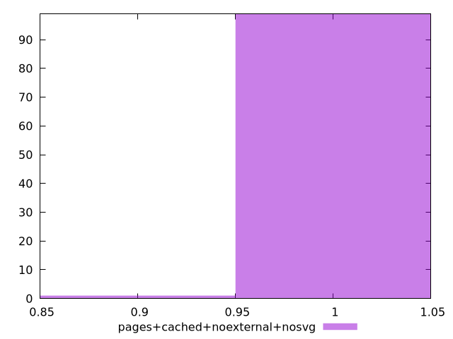
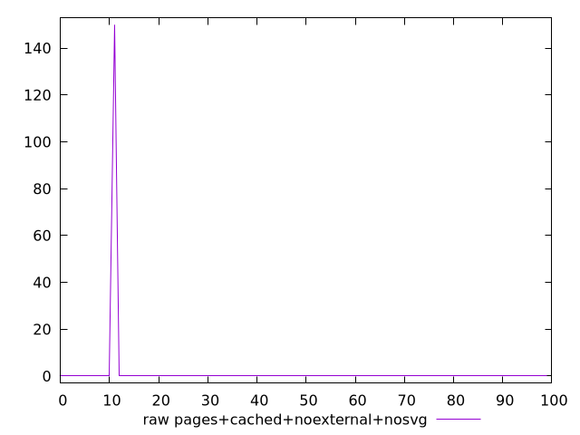
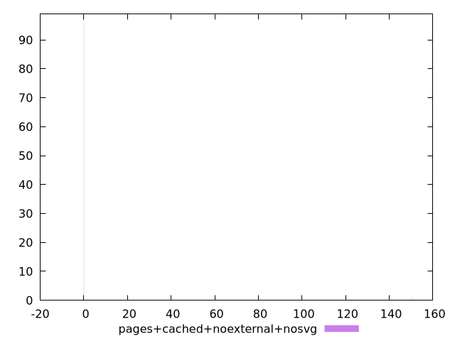

# Report pages+cached+noexternal+nosvg

[parent..](./..)  


## Scores

  

## Score Histogram

  

## Score Indicators

```yaml
min: 0.875
max: 1
range: 0.125
mean: 0.99875
median: 1
stdev: 0.012437342963832749
skewness: -9.84937058954032

```

## Raw Values

  

## Raw Values Histogram

  

## Raw Indicators

```yaml
min: 0
max: 150
range: 150
mean: 1.5
median: 0
stdev: 14.9248115565993
skewness: 9.849370589540309

```

<style>
  img {
    max-width: 80%;
  }
</style>
      
