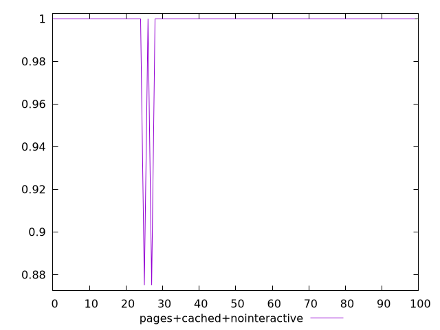
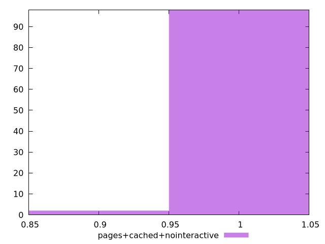
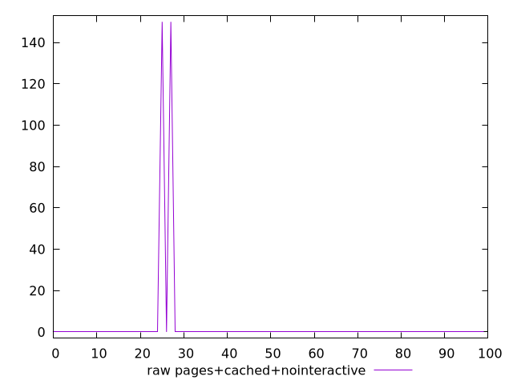
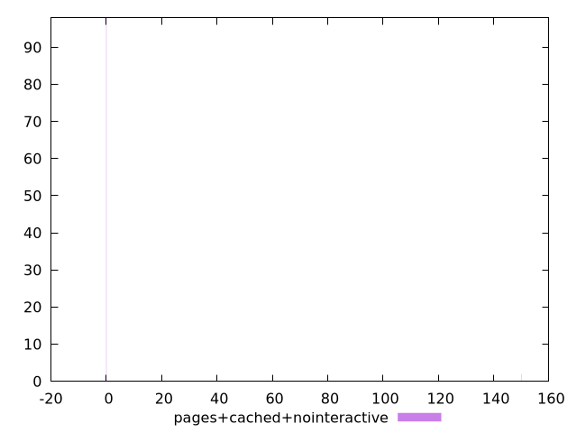

# Report pages+cached+nointeractive

[parent..](./..)  


## Scores

  

## Score Histogram

  

## Score Indicators

```yaml
min: 0.875
max: 1
range: 0.125
mean: 0.9975
median: 1
stdev: 0.017499999999999998
skewness: -6.857142857142833

```

## Raw Values

  

## Raw Values Histogram

  

## Raw Indicators

```yaml
min: 0
max: 150
range: 150
mean: 3
median: 0
stdev: 21
skewness: 6.857142857142822

```

<style>
  img {
    max-width: 80%;
  }
</style>
      
