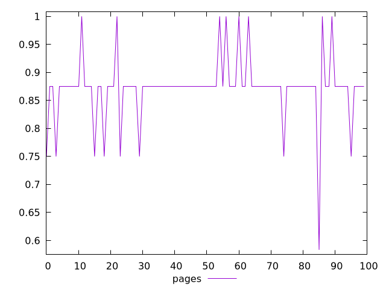
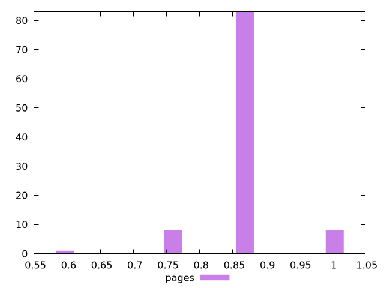
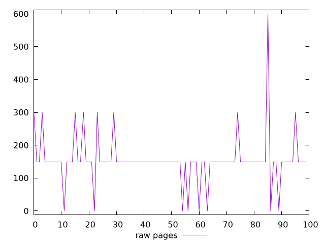
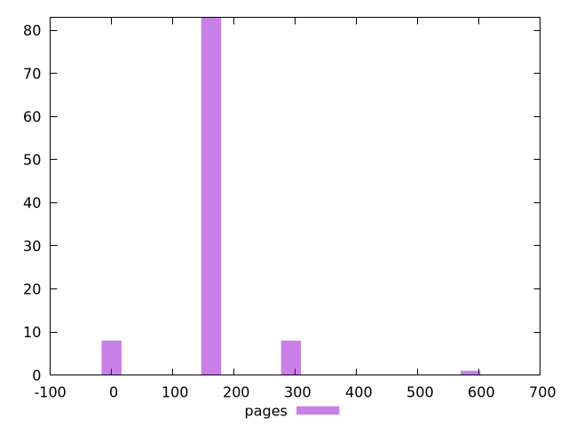

# Report pages

[parent..](./..)  


## Scores

  

## Score Histogram

  

## Score Indicators

```yaml
min: 0.5833333333333334
max: 1
range: 0.41666666666666663
mean: 0.8720833333333334
median: 0.875
stdev: 0.05781165539923582
skewness: -1.1326633597409466

```

## Raw Values

  

## Raw Values Histogram

  

## Raw Indicators

```yaml
min: 0
max: 600
range: 600
mean: 154.5
median: 150
stdev: 74.86487828080668
skewness: 1.9911746602423435

```

<style>
  img {
    max-width: 80%;
  }
</style>
      
