# Report unused-css-rules

[parent..](./..)  

[empty](./empty/)  
[pages](./pages/)  
[pages+cached](./pages+cached/)  
[pages+cached+noadtech](./pages+cached+noadtech/)  
[pages+cached+noexternal](./pages+cached+noexternal/)  
[pages+cached+noexternal+nocss](./pages+cached+noexternal+nocss/)  
[pages+cached+noexternal+nofonts](./pages+cached+noexternal+nofonts/)  
[pages+cached+noexternal+nofonts+nosvg+noimg](./pages+cached+noexternal+nofonts+nosvg+noimg/)  
[pages+cached+noexternal+nofonts+nosvg+noimg+nocss](./pages+cached+noexternal+nofonts+nosvg+noimg+nocss/)  
[pages+cached+noexternal+nofonts+nosvg+noimg+nocss+nojs](./pages+cached+noexternal+nofonts+nosvg+noimg+nocss+nojs/)  
[pages+cached+noexternal+noimg](./pages+cached+noexternal+noimg/)  
[pages+cached+noexternal+nojs](./pages+cached+noexternal+nojs/)  
[pages+cached+noexternal+nosvg](./pages+cached+noexternal+nosvg/)  
[pages+cached+nointeractive](./pages+cached+nointeractive/)  

## Comparison

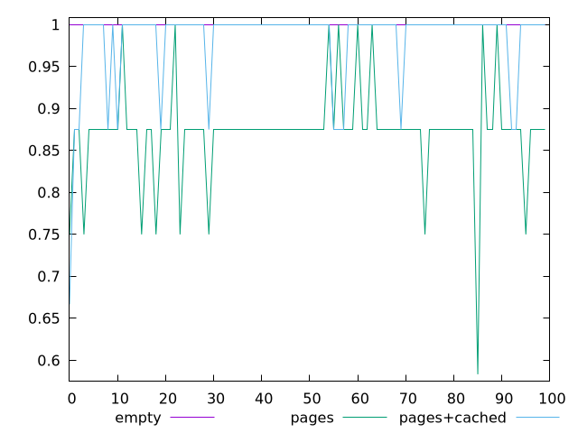  
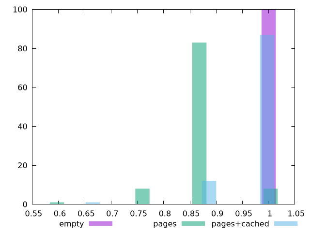  
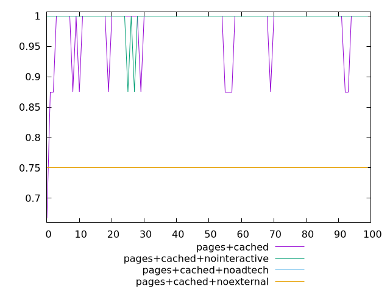  
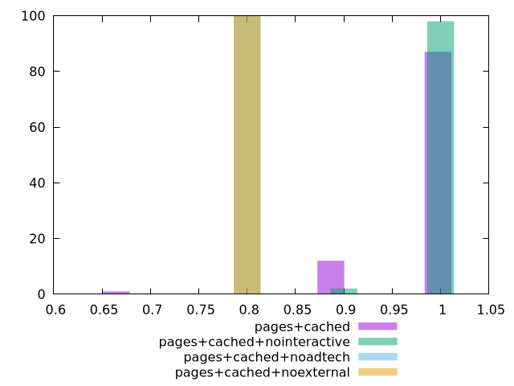  
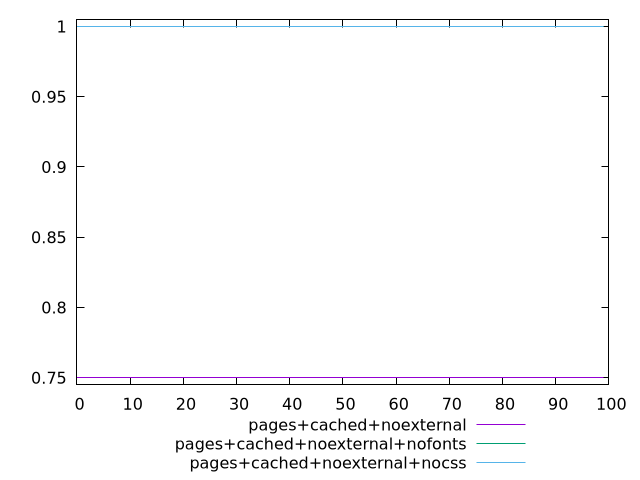  
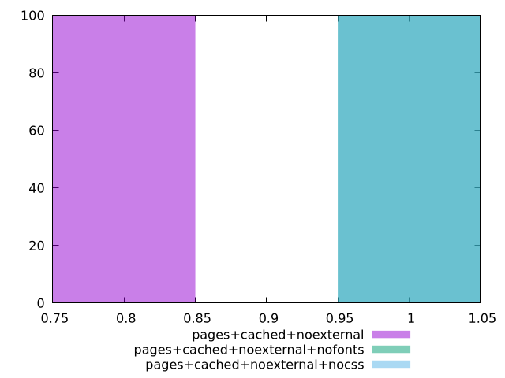  
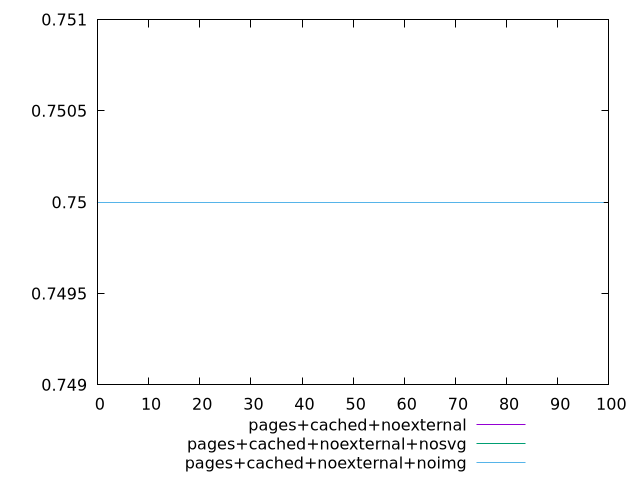  
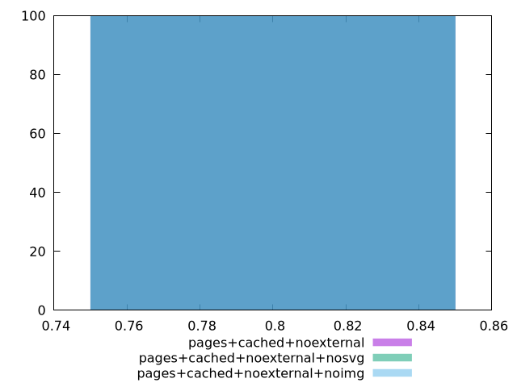  
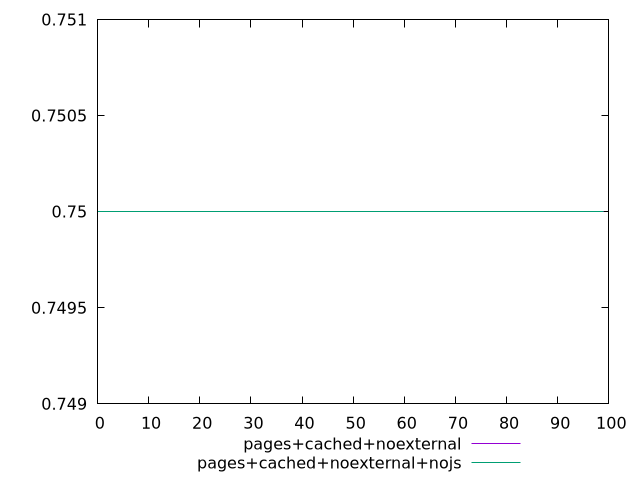  
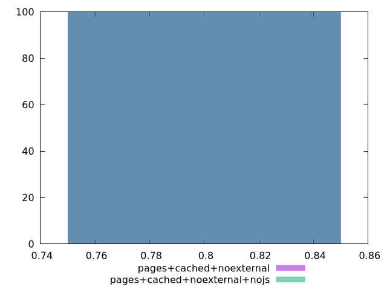  
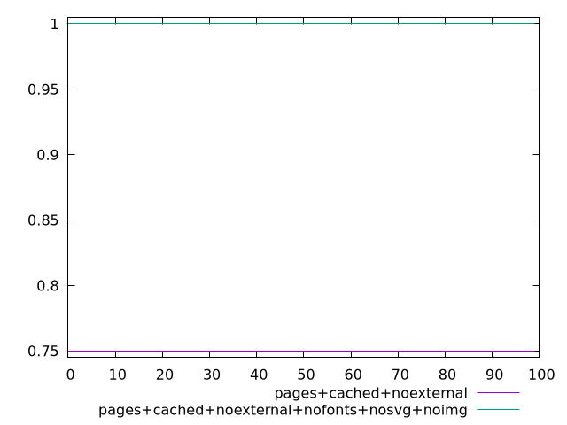  
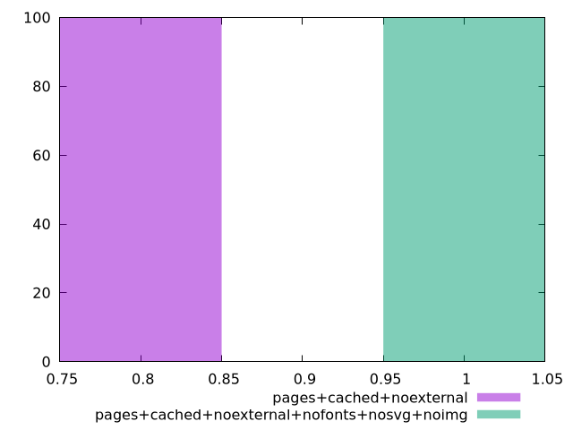  
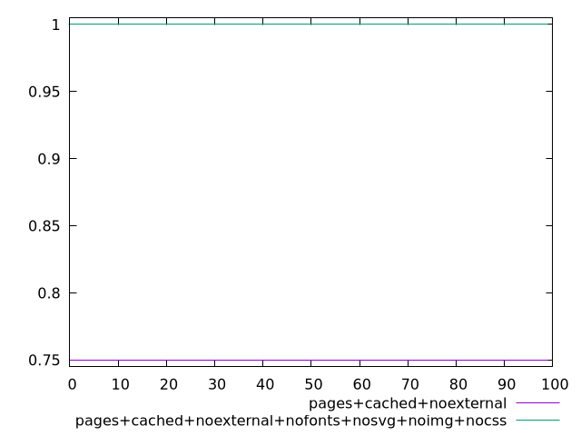  
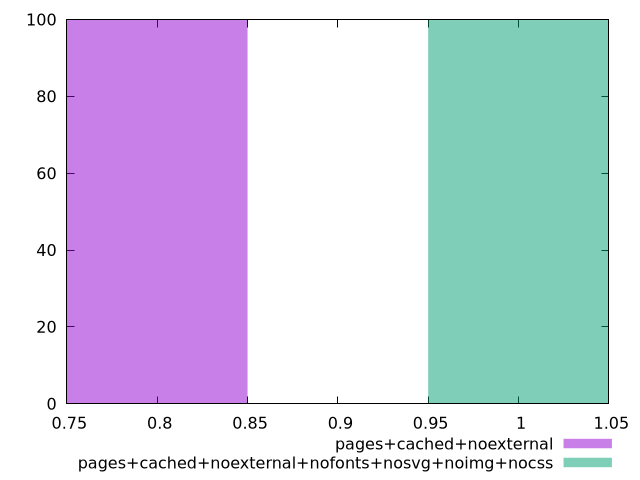  
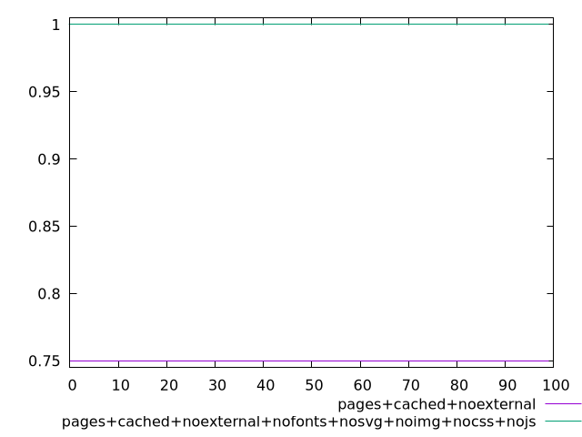  
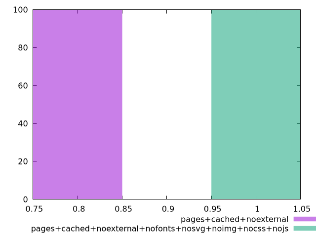  

      
