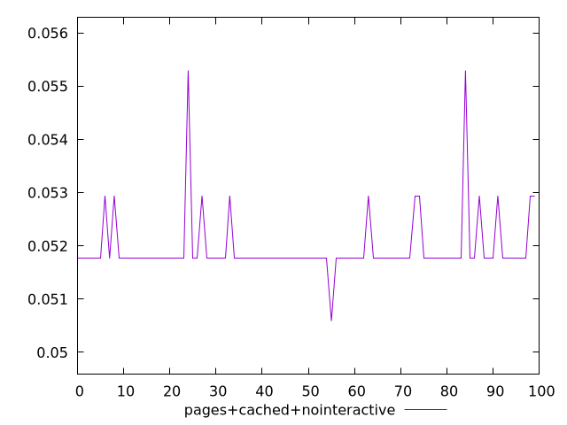
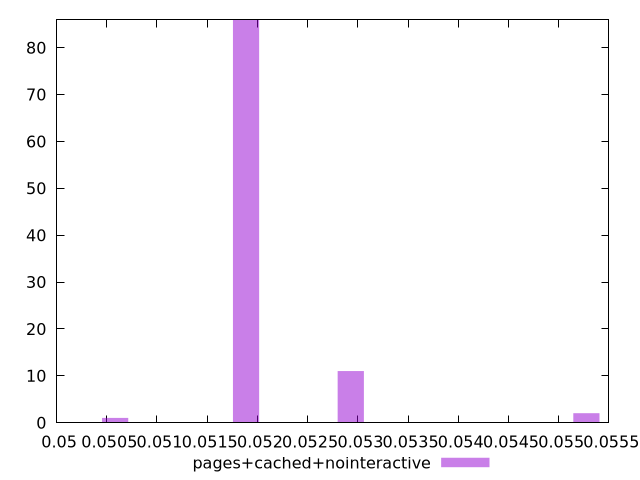
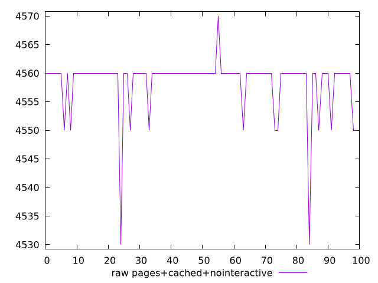
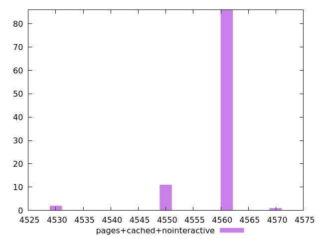

# Report pages+cached+nointeractive

[parent..](./..)  


## Scores

  

## Score Histogram

  

## Score Indicators

```yaml
min: 0.050588235294117656
max: 0.05529411764705883
range: 0.004705882352941171
mean: 0.05195294117647058
median: 0.051764705882352935
stdev: 0.0006162729813510005
skewness: 3.507678573571215

```

## Raw Values

  

## Raw Values Histogram

  

## Raw Indicators

```yaml
min: 4530
max: 4570
range: 40
mean: 4558.4
median: 4560
stdev: 5.238320341483517
skewness: -3.5076785735709386

```

<style>
  img {
    max-width: 80%;
  }
</style>
      
