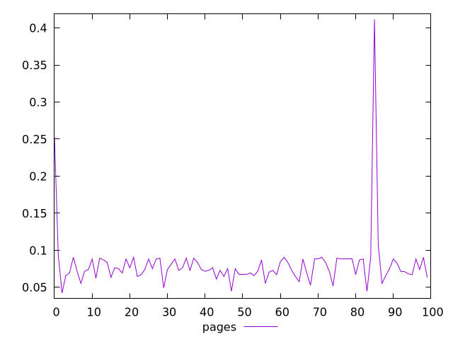
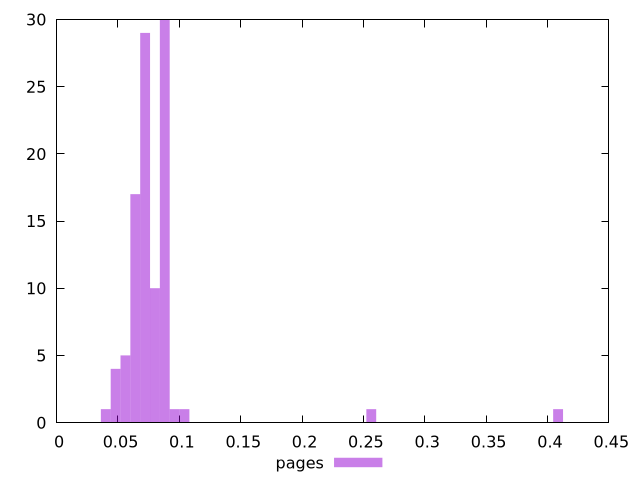
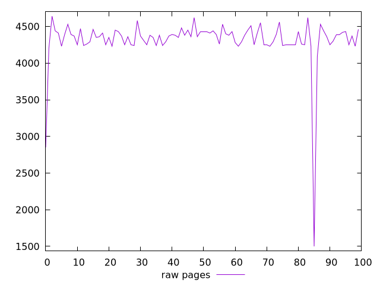
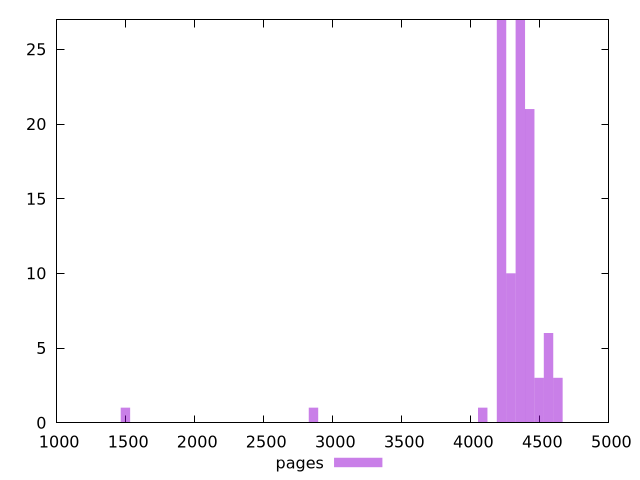

# Report pages

[parent..](./..)  


## Scores

  

## Score Histogram

  

## Score Indicators

```yaml
min: 0.04235294117647059
max: 0.4117647058823529
range: 0.36941176470588233
mean: 0.08054117647058824
median: 0.07411764705882351
stdev: 0.03967460031348272
skewness: 6.587286326255337

```

## Raw Values

  

## Raw Values Histogram

  

## Raw Indicators

```yaml
min: 1500
max: 4640
range: 3140
mean: 4315.4
median: 4370
stdev: 337.23410266460314
skewness: -6.587286326255335

```

<style>
  img {
    max-width: 80%;
  }
</style>
      
