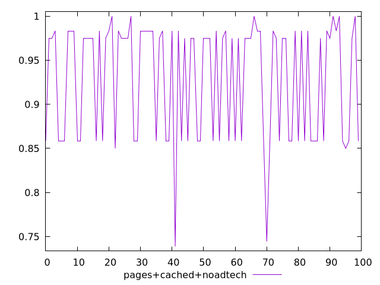
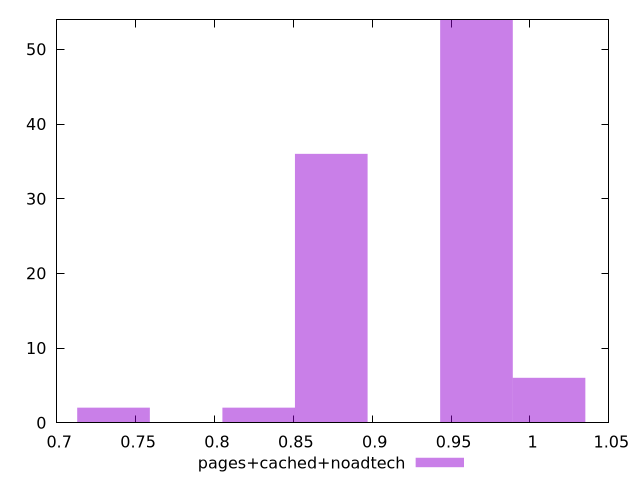
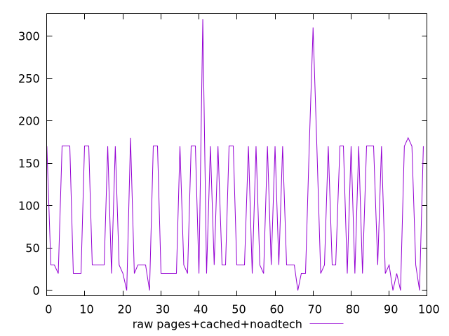
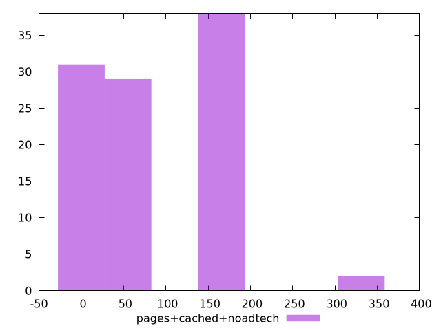

# Report pages+cached+noadtech

[parent..](./..)  


## Scores

  

## Score Histogram

  

## Score Indicators

```yaml
min: 0.7388888888888889
max: 1
range: 0.26111111111111107
mean: 0.9294166666666667
median: 0.975
stdev: 0.06541073339452688
skewness: -0.6575356700028785

```

## Raw Values

  

## Raw Values Histogram

  

## Raw Indicators

```yaml
min: 0
max: 320
range: 320
mean: 84.8
median: 30
stdev: 78.78426238786525
skewness: 0.6786950463474659

```

<style>
  img {
    max-width: 80%;
  }
</style>
      
