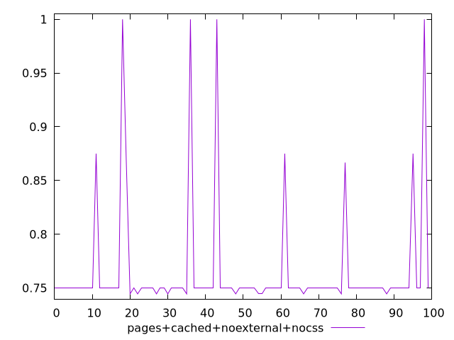
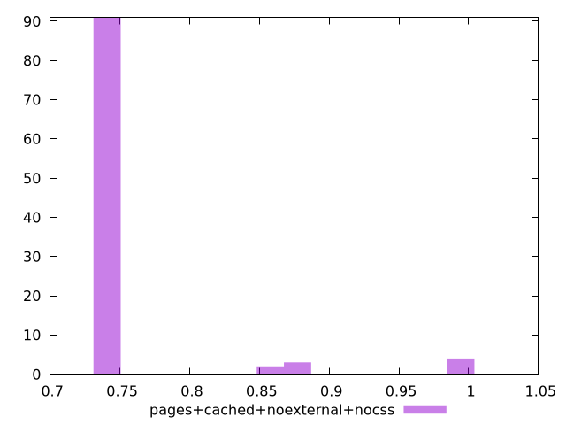
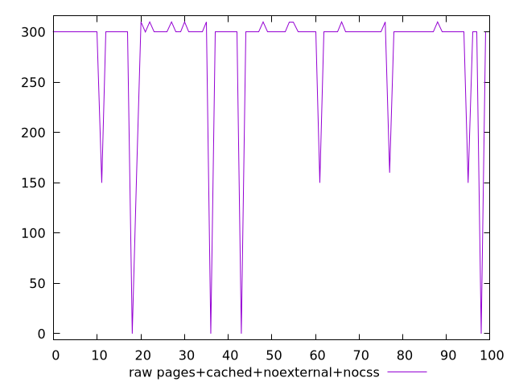
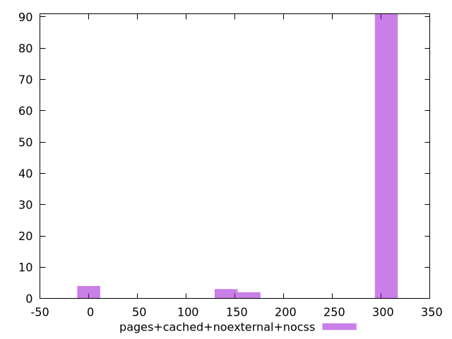

# Report pages+cached+noexternal+nocss

[parent..](./..)  


## Scores

  

## Score Histogram

  

## Score Indicators

```yaml
min: 0.7444444444444445
max: 1
range: 0.25555555555555554
mean: 0.7654722222222224
median: 0.75
stdev: 0.054817676195336784
skewness: 3.4733411482641725

```

## Raw Values

  

## Raw Values Histogram

  

## Raw Indicators

```yaml
min: 0
max: 310
range: 310
mean: 281.8
median: 300
stdev: 65.92996283936459
skewness: -3.4637879824999676

```

<style>
  img {
    max-width: 80%;
  }
</style>
      
