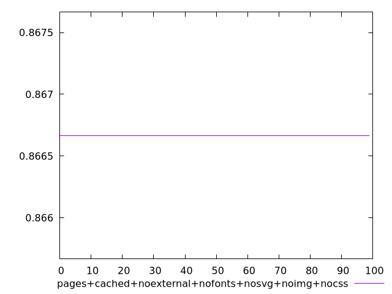
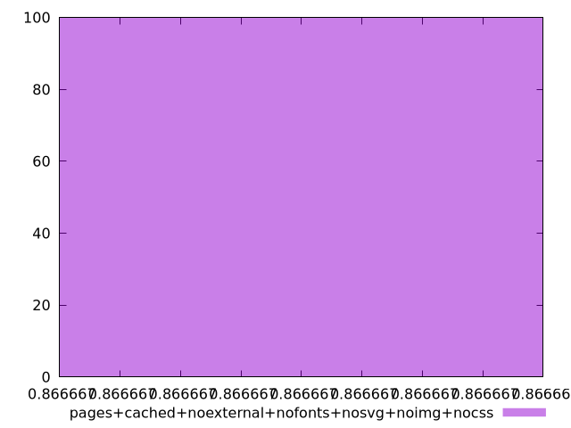
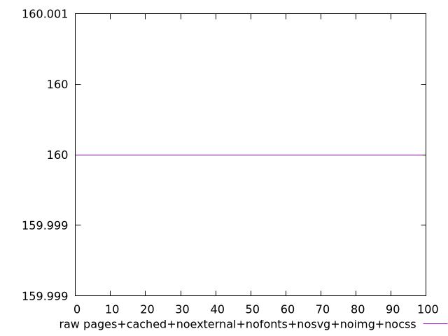
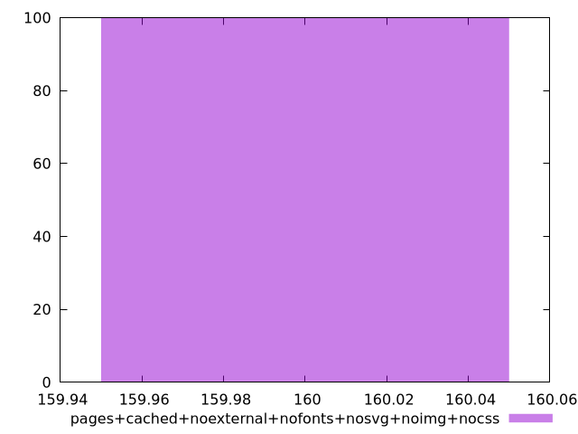

# Report pages+cached+noexternal+nofonts+nosvg+noimg+nocss

[parent..](./..)  


## Scores

  

## Score Histogram

  

## Score Indicators

```yaml
min: 0.8666666666666667
max: 0.8666666666666667
range: 0
mean: 0.8666666666666651
median: 0.8666666666666667
stdev: 1.5543122344752192e-15
skewness: 1

```

## Raw Values

  

## Raw Values Histogram

  

## Raw Indicators

```yaml
min: 160
max: 160
range: 0
mean: 160
median: 160
stdev: 0
skewness: .nan

```

<style>
  img {
    max-width: 80%;
  }
</style>
      
