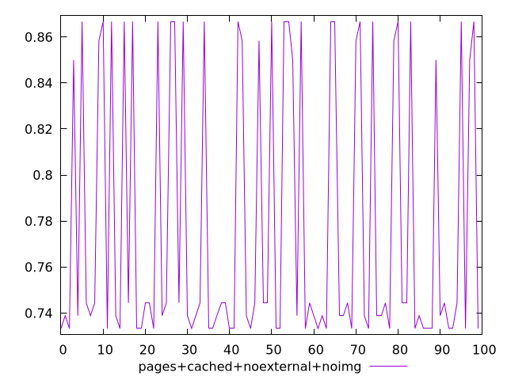
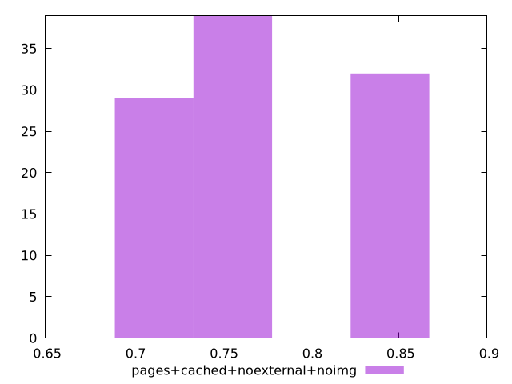
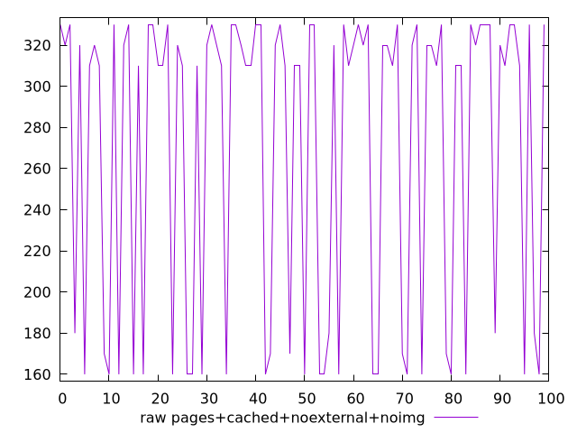
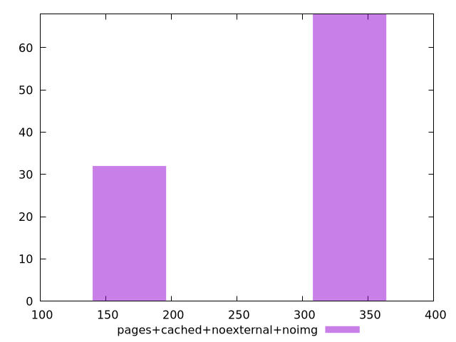

# Report pages+cached+noexternal+noimg

[parent..](./..)  


## Scores

  

## Score Histogram

  

## Score Indicators

```yaml
min: 0.7333333333333333
max: 0.8666666666666667
range: 0.13333333333333341
mean: 0.7781944444444445
median: 0.7444444444444445
stdev: 0.058588562013121945
skewness: 0.7677784159912778

```

## Raw Values

  

## Raw Values Histogram

  

## Raw Indicators

```yaml
min: 160
max: 330
range: 170
mean: 271
median: 310
stdev: 73.79024325749306
skewness: -0.7527255528765632

```

<style>
  img {
    max-width: 80%;
  }
</style>
      
