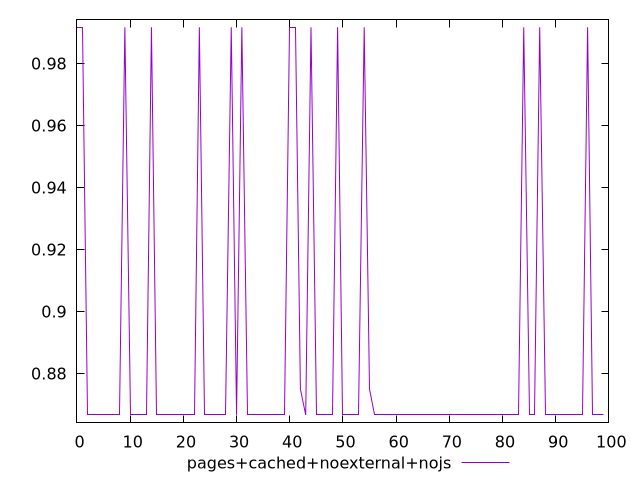
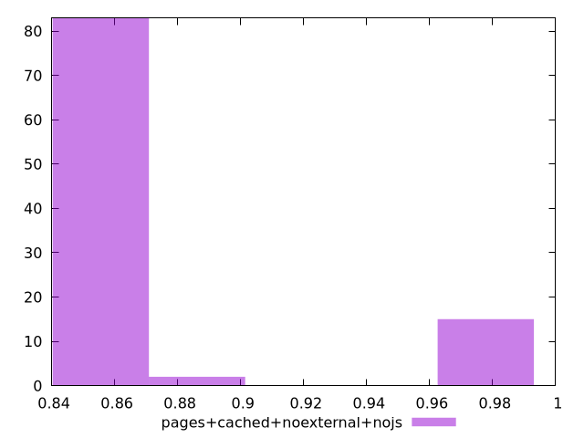
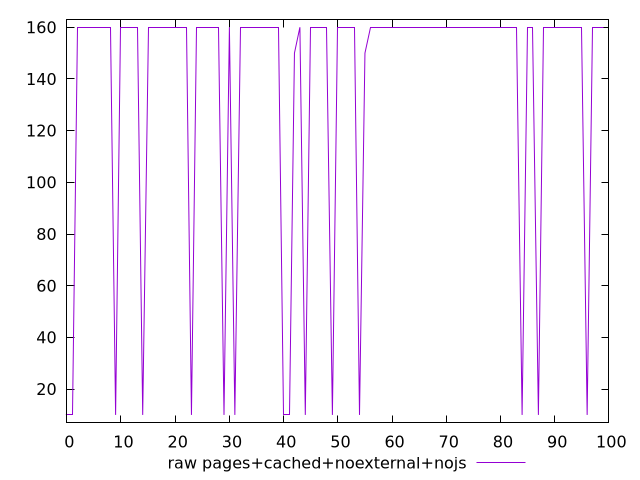
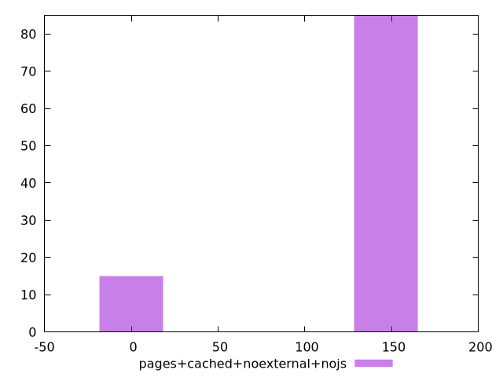

# Report pages+cached+noexternal+nojs

[parent..](./..)  


## Scores

  

## Score Histogram

  

## Score Indicators

```yaml
min: 0.8666666666666667
max: 0.9916666666666667
range: 0.125
mean: 0.8855833333333318
median: 0.8666666666666667
stdev: 0.044579127527477586
skewness: 1.9576475056190636

```

## Raw Values

  

## Raw Values Histogram

  

## Raw Indicators

```yaml
min: 10
max: 160
range: 150
mean: 137.3
median: 160
stdev: 53.49495303297314
skewness: -1.9576475056189515

```

<style>
  img {
    max-width: 80%;
  }
</style>
      
