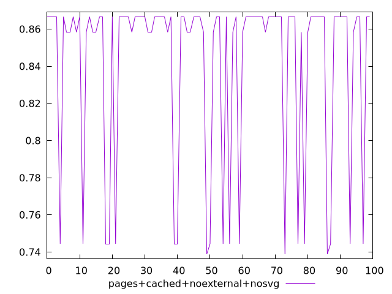
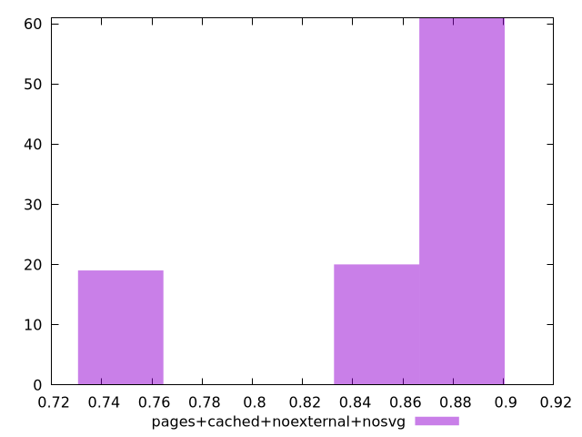
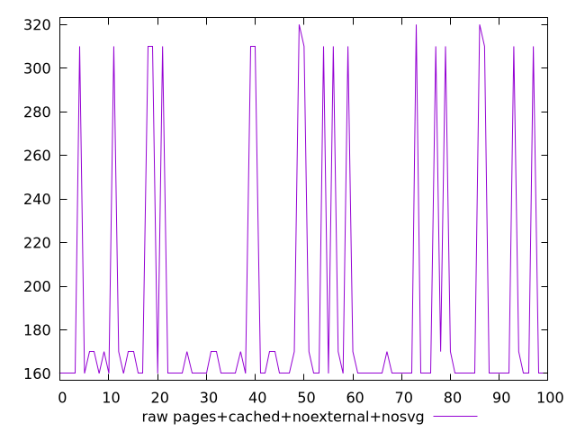
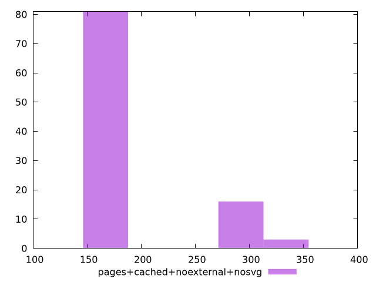

# Report pages+cached+noexternal+nosvg

[parent..](./..)  


## Scores

  

## Score Histogram

  

## Score Indicators

```yaml
min: 0.7388888888888889
max: 0.8666666666666667
range: 0.12777777777777777
mean: 0.8416111111111105
median: 0.8666666666666667
stdev: 0.04760300721904341
skewness: -1.564548785057394

```

## Raw Values

  

## Raw Values Histogram

  

## Raw Indicators

```yaml
min: 160
max: 320
range: 160
mean: 190.8
median: 160
stdev: 58.646056985956065
skewness: 1.5669674856488656

```

<style>
  img {
    max-width: 80%;
  }
</style>
      
