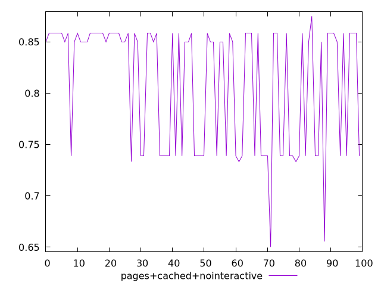
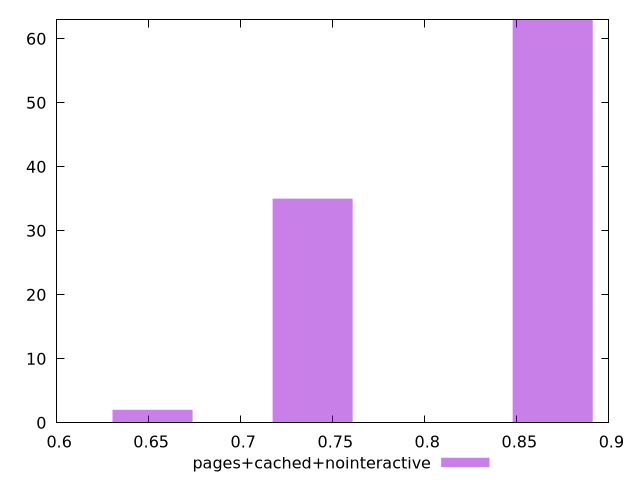
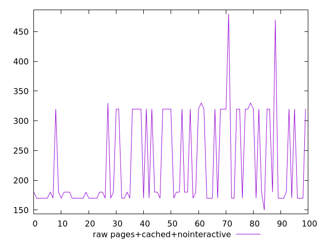
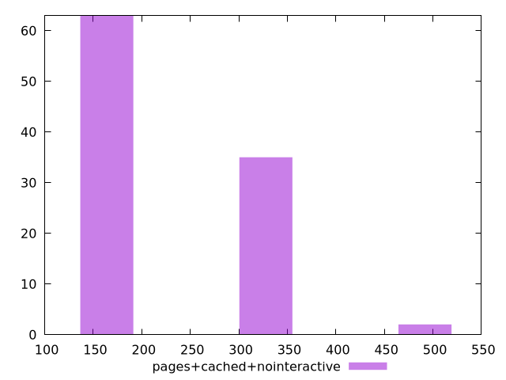

# Report pages+cached+nointeractive

[parent..](./..)  


## Scores

  

## Score Histogram

  

## Score Indicators

```yaml
min: 0.65
max: 0.875
range: 0.22499999999999998
mean: 0.8106666666666663
median: 0.85
stdev: 0.06020505085246706
skewness: -0.6926801346933253

```

## Raw Values

  

## Raw Values Histogram

  

## Raw Indicators

```yaml
min: 150
max: 480
range: 330
mean: 230.8
median: 180
stdev: 78.46884732172386
skewness: 0.8756126322466211

```

<style>
  img {
    max-width: 80%;
  }
</style>
      
