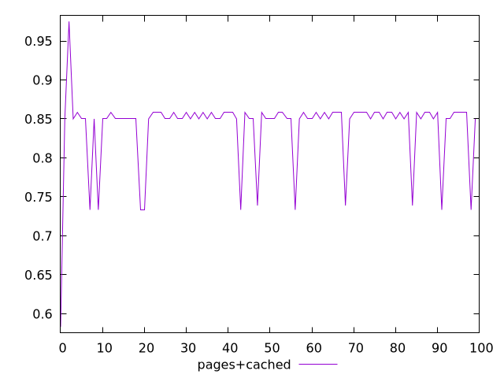
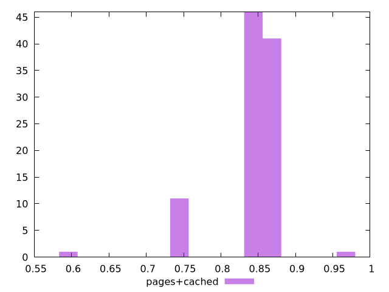
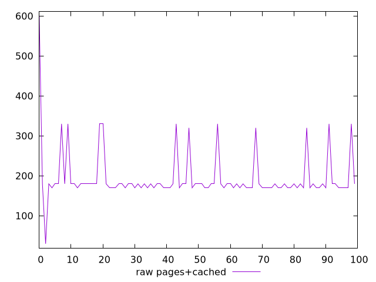
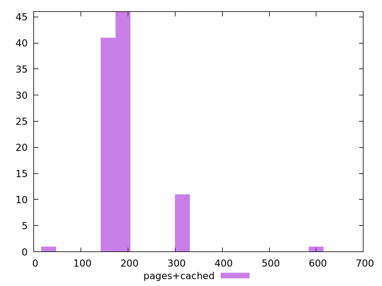

# Report pages+cached

[parent..](./..)  


## Scores

  

## Score Histogram

  

## Score Indicators

```yaml
min: 0.5833333333333334
max: 0.975
range: 0.3916666666666666
mean: 0.839333333333333
median: 0.85
stdev: 0.04734252649378587
skewness: -2.4985010090963558

```

## Raw Values

  

## Raw Values Histogram

  

## Raw Indicators

```yaml
min: 30
max: 600
range: 570
mean: 194.8
median: 180
stdev: 64.79938271310925
skewness: 3.1951351860027906

```

<style>
  img {
    max-width: 80%;
  }
</style>
      
