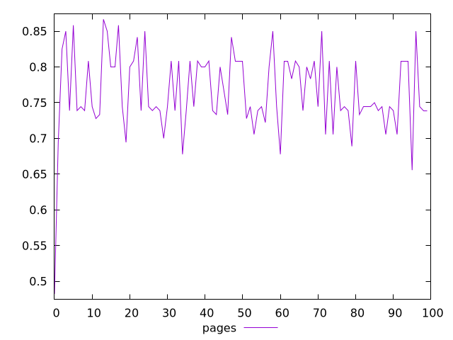
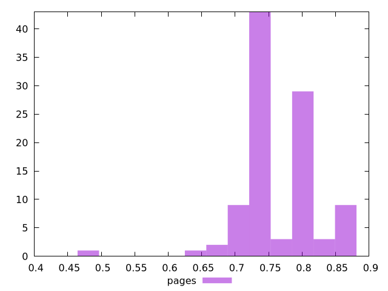
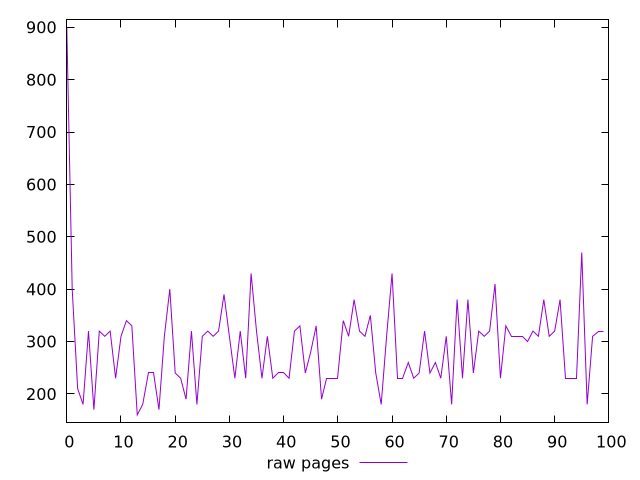
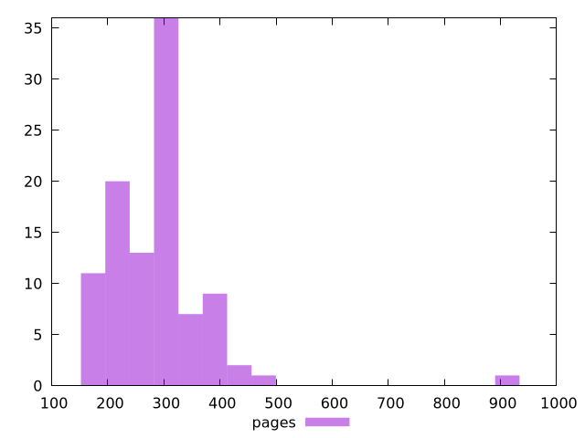

# Report pages

[parent..](./..)  


## Scores

  

## Score Histogram

  

## Score Indicators

```yaml
min: 0.4823529411764706
max: 0.8666666666666667
range: 0.3843137254901961
mean: 0.7650457516339866
median: 0.7444444444444445
stdev: 0.05548194700689143
skewness: -1.1144767686427106

```

## Raw Values

  

## Raw Values Histogram

  

## Raw Indicators

```yaml
min: 160
max: 900
range: 740
mean: 291.4
median: 310
stdev: 90.01133261984296
skewness: 3.0674127151598674

```

<style>
  img {
    max-width: 80%;
  }
</style>
      
