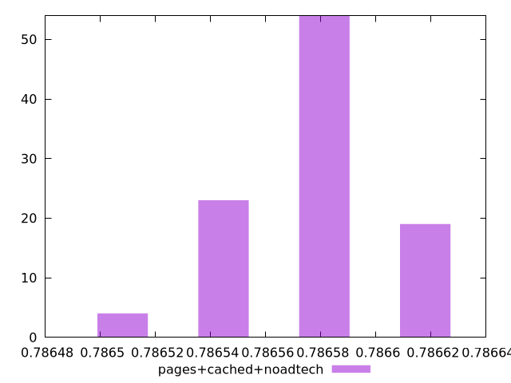

# Report pages+cached+noadtech

[parent..](./..)  


## Scores

  

## Score Histogram

  

## Score Indicators

```yaml
min: 0.786499404347403
max: 0.7866146671291339
range: 0.0001152627817309071
mean: 0.7865725946758338
median: 0.7865762442162387
stdev: 0.000028153077234286674
skewness: -0.34262145566546304

```

## Raw Values

  

## Raw Values Histogram

  

## Raw Indicators

```yaml
min: 51073
max: 51097
range: 24
mean: 51081.76
median: 51081
stdev: 5.861945069684641
skewness: 0.34272243561472565

```

<style>
  img {
    max-width: 80%;
  }
</style>
      
