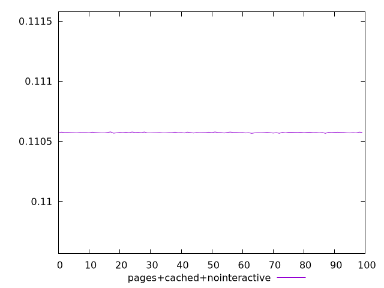
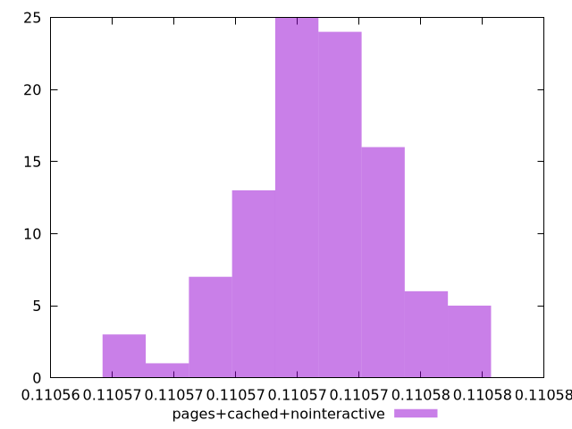
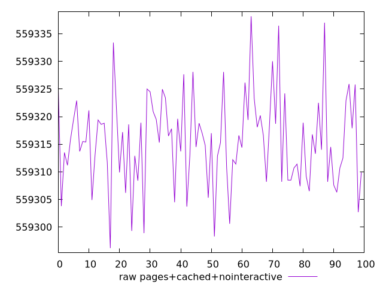
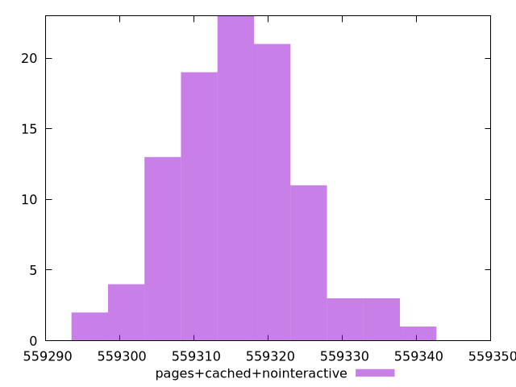

# Report pages+cached+nointeractive

[parent..](./..)  


## Scores

  

## Score Histogram

  

## Score Indicators

```yaml
min: 0.11056629013412189
max: 0.11057822996601496
range: 0.000011939831893070796
mean: 0.11057268883405857
median: 0.1105727525080073
stdev: 0.0000023738945137932745
skewness: -0.21319304698148453

```

## Raw Values

  

## Raw Values Histogram

  

## Raw Indicators

```yaml
min: 559296.2035413408
max: 559338.1657511484
range: 41.962209807592444
mean: 559315.6770277786
median: 559315.4531223464
stdev: 8.342968059226036
skewness: 0.2132910218553018

```

<style>
  img {
    max-width: 80%;
  }
</style>
      
