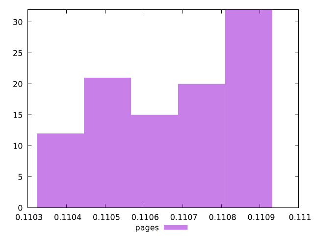

# Report pages

[parent..](./..)  


## Scores

  

## Score Histogram

  

## Score Indicators

```yaml
min: 0.11037960372103645
max: 0.11090281313749306
range: 0.0005232094164566159
mean: 0.11068100308196646
median: 0.11070865595136312
stdev: 0.00016891176030470878
skewness: -0.2804359605577183

```

## Raw Values

  

## Raw Values Histogram

  

## Raw Indicators

```yaml
min: 558157.9094985723
max: 559995.1029763501
range: 1837.1934777777642
mean: 558935.9132888224
median: 558838.2446360723
stdev: 592.9931064603684
skewness: 0.2822202337559003

```

<style>
  img {
    max-width: 80%;
  }
</style>
      
